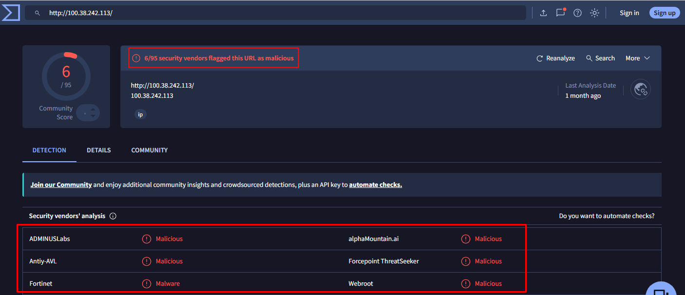
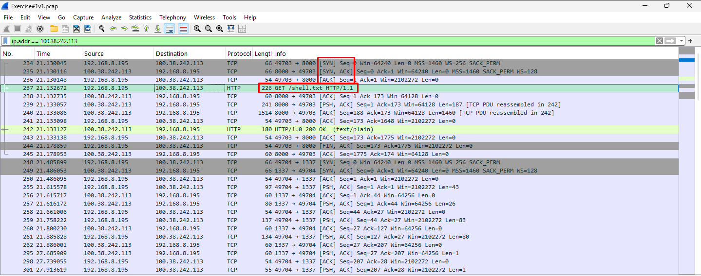
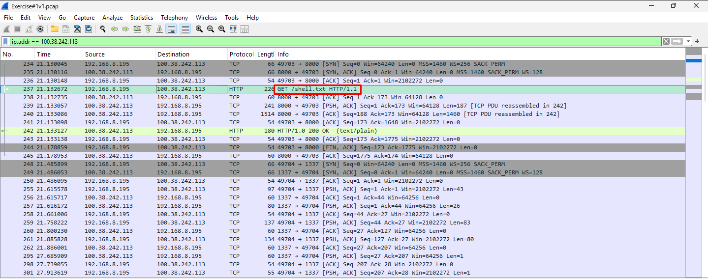
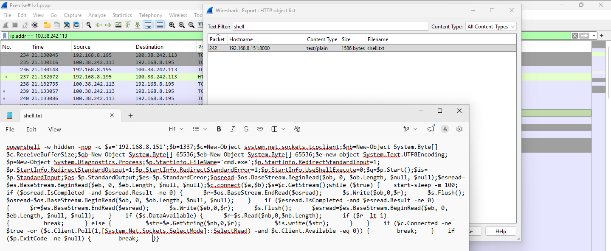
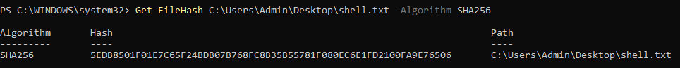
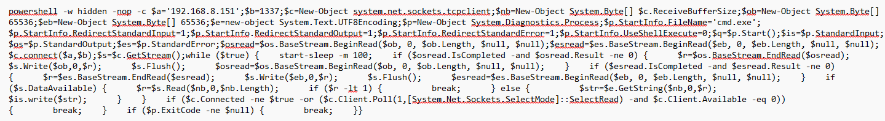
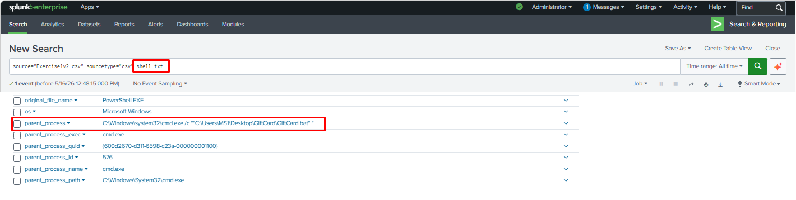
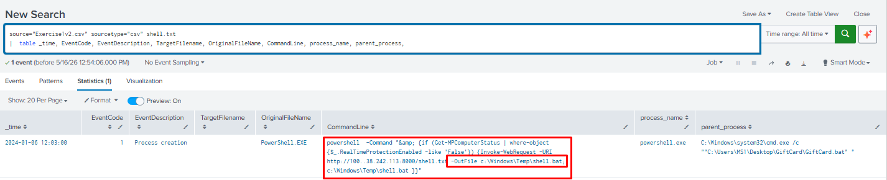
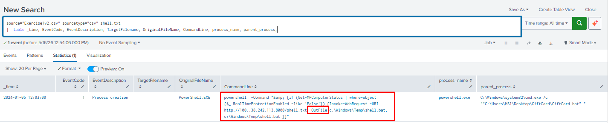
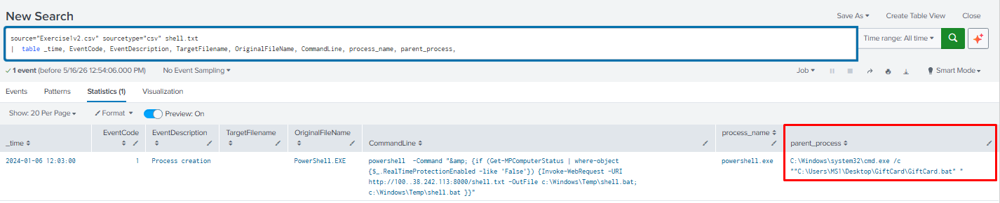

# 🔵 Case 01 - Incident Response Exercise 1 | Malicious IP Connection

**Date of Incident:** Lab-based scenario

**Type:** Malicious IP / Malware Download / Endpoint Compromise

**Collection Method:** PCAP Analysis (Wireshark) + Endpoint Logs (Splunk)

**Investigator:** *Samir Aliguliyev*

**Status:** ✅ Complete

---

## 📋 Table of Contents

1. [Scenario](#scenario)
2. [Investigation Methodology](#investigation-methodology)
3. [Tools Used](#tools-used)
4. [Findings - Q&A](#findings---qa)
5. [MITRE ATT&CK Mapping](#mitre-attck-mapping)
6. [Lessons Learned](#lessons-learned)

---

## Scenario

The SOC shift lead assigned an alert for a connection to a suspicious IP address **100.38.242.113**. No additional context was provided. The investigation involved both PCAP analysis using Wireshark and endpoint log analysis using Splunk to determine the scope of the compromise.

**Investigation scope:** PCAP file analysis + Splunk endpoint event logs.

---

## Investigation Methodology

```
Alert: Suspicious IP Connection (100.38.242.113)
      │
      ├── PCAP Analysis (Wireshark)
      │     ├── OSINT           → IP reputation research
      │     ├── IP filter       → Confirm connection
      │     ├── File carving    → Extract malware from pcap
      │     └── Hash analysis   → VirusTotal lookup
      │
      └── Endpoint Analysis (Splunk)
            ├── shell.txt pivot → File download artifacts
            ├── Parent process  → Execution chain
            └── File path       → Dropped file location
```

---

## Tools Used

| Tool | Purpose |
|------|---------|
| **Wireshark** | PCAP analysis - traffic filtering, file carving |
| **Splunk** | Endpoint log analysis - event correlation |
| **VirusTotal** | File hash reputation and malware analysis |

---

## Findings - Q&A

### Part 1 - PCAP Analysis

#### 1. OSINT on Malicious IP

**Q: Is there published OSINT on the IP address 100.38.242.113? If so, what?**
> 🔍 *Tool: VirusTotal*

**A:** `Yes`



---

#### 2. Connection Confirmation

**Q: Was there a successful connection to the suspicious IP address?**
> 🔍 *Tool: Wireshark - filter: ip.addr == 100.38.242.113*

```
ip.addr == 100.38.242.113
```

**A:** `Yes`



---

#### 3. Malware Download

**Q: Was malware downloaded? If so, what is the name of the malicious file?**
> 🔍 *Tool: Wireshark - HTTP objects / Follow TCP Stream*

**A:** `shell.txt`



---

#### 4. File Carving

**Q: Could you carve/export any files from the pcap?**
> 🔍 *Tool: Wireshark → File → Export Objects → HTTP*

**A:** `Yes`



---

#### 5. SHA256 Hash

**Q: What is the SHA256 hash of the file?**
> 🔍 *Tool: PowerShell / VirusTotal*

```powershell
Get-FileHash shell.txt -Algorithm SHA256
```

**A:** `5EDB8501F01E7C65F24BDB07B768FC8B35B55781F080EC6E1FD2100FA9E76506`



---

#### 6. Malware Behaviour

**Q: What does the malware do?**

**A:** `shell.txt is a PowerShell reverse shell that connects back to C2 server 
192.168.8.151 on port 1337, spawns a hidden cmd.exe process and redirects 
its input/output over a TCP socket - giving the attacker full command-line 
access to the victim system.`



---

#### 7. Data Exfiltration

**Q: Was there any information stolen?**

**A:** `Potentially yes - attacker had full interactive shell access via cmd.exe, 
allowing them to execute any commands, exfiltrate files, or move laterally.`


---

#### 8. Root Cause

**Q: What was the cause of the connection to the malicious IP address?**
> 🔍 *Tool: Splunk*

**A:** `GiftCard.bat`



---

### Part 2 - Splunk Analysis

#### 9. Downloaded File - Name and Path

**Q: What is the name of the downloaded file on the system and what is the path to the file?**
> 🔍 *Artifact: Splunk - TargetFilename field*

```spl
source="Exercise1v2.csv" sourcetype="csv" shell.txt
| table _time, EventCode, EventDescription, TargetFilename, OriginalFileName, CommandLine, process_name, parent_process
```

**A:** `Filename: shell.bat
Path: C:\Windows\Temp\shell.bat`



---

#### 10. File Extension

**Q: Why is the file extension different?**
> 🔍 *Artifact: Splunk - CommandLine field*

**A:** The file was downloaded as `shell.txt` from the malicious server but saved to disk as `shell.bat` using the PowerShell `-OutFile` parameter. Renaming to `.bat` allowed the file to execute directly as a batch script.



---

#### 11. Parent Process

**Q: What is the parent process?**
> 🔍 *Artifact: Splunk - parent_process field*

**A:** `C:\Windows\system32\cmd.exe /c ""C:\Users\MS1\Desktop\GiftCard\GiftCard.bat" "`



---

## MITRE ATT&CK Mapping

| Tactic | Technique | ID | Evidence |
|--------|-----------|----|---------|
| Initial Access | Drive-by Compromise | T1189 | Connection initiated to malicious IP |
| Execution | Command and Scripting Interpreter | T1059 | shell.txt executed on endpoint |
| Defense Evasion | Masquerading - Rename System Utilities | T1036.003 | File extension changed to avoid detection |
| Command & Control | Non-Standard Port | T1571 | C2 connection to 100.38.242.113 |
| Exfiltration | Exfiltration Over C2 Channel | T1041 | Potential data theft via C2 connection |

---

## Lessons Learned

### 🔴 Attacker Techniques Observed
- **Malicious IP** used for C2 - had published OSINT reputation
- **File carving** from PCAP revealed the malware dropped on the system
- **File extension renamed** to evade endpoint detection
- **Parent process** reveals the execution chain and initial compromise vector

### 🔵 Defensive Recommendations
- Block known malicious IPs at perimeter firewall using threat intel feeds
- Alert on **file extension mismatches** between OriginalFileName and TargetFilename
- Monitor **outbound connections** to low-reputation IPs
- Correlate **PCAP + endpoint logs** for complete incident picture - neither alone tells the full story

### 🟡 Forensic Notes
- Wireshark **HTTP object export** allowed direct file carving without additional tools
- Pivoting from PCAP findings (shell.txt) into Splunk connected network and endpoint evidence
- SHA256 hash submission to VirusTotal confirmed malware classification and behaviour
