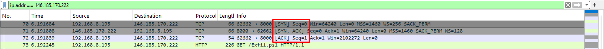
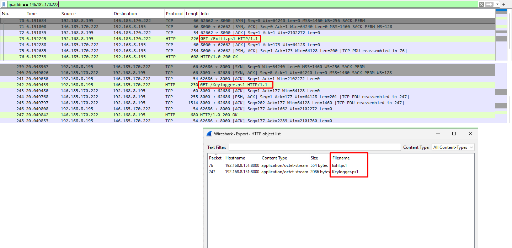
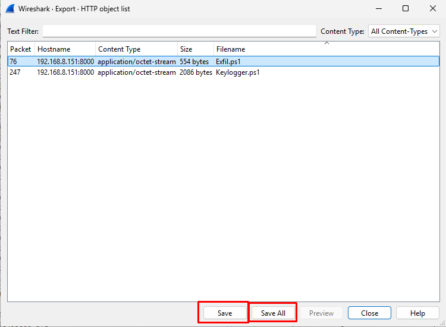
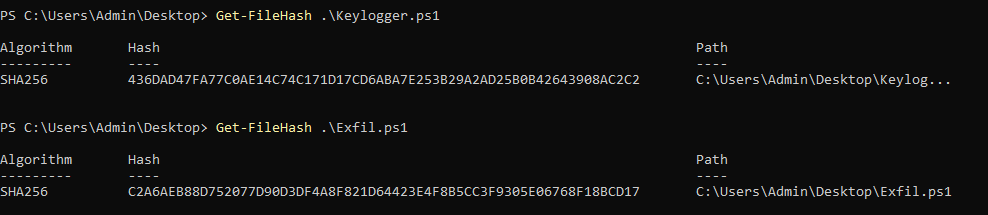
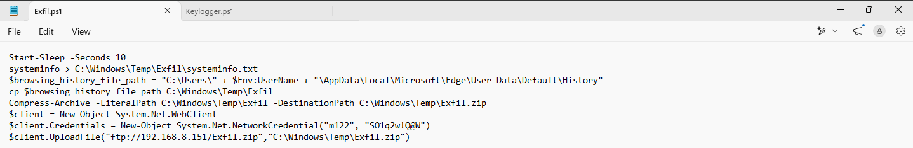
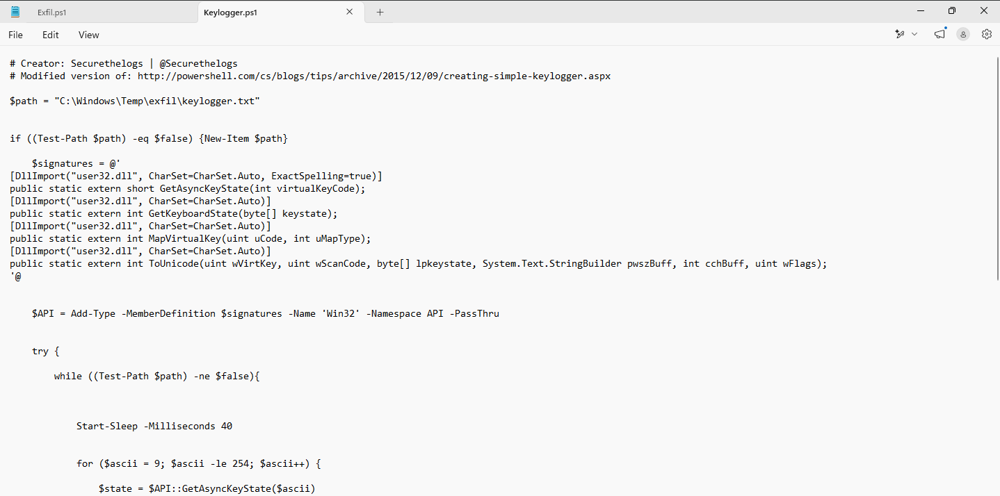
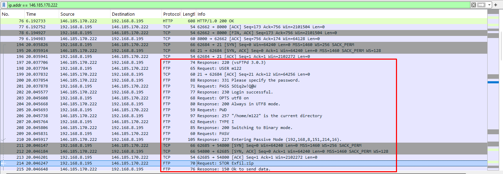
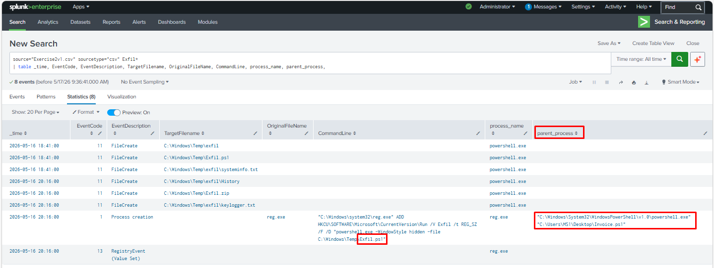
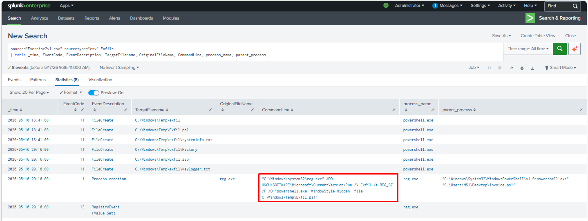
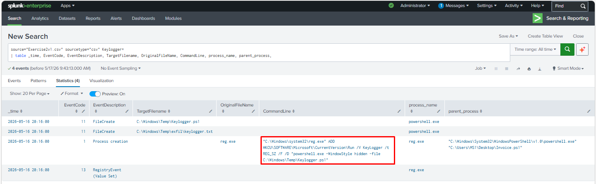

# 🔵 Case 02 - Incident Response Exercise 2 | Keylogger & Data Exfiltration

**Date of Incident:** Lab-based scenario

**Type:** Malicious IP / Malware Download / Keylogger / Data Exfiltration / Persistence

**Collection Method:** PCAP Analysis (Wireshark) + Endpoint Logs (Splunk)

**Investigator:** *Samir Aliguliyev*

**Status:** ✅ Complete

---

## 📋 Table of Contents

1. [Scenario](#scenario)
2. [Investigation Methodology](#investigation-methodology)
3. [Tools Used](#tools-used)
4. [Findings - Q&A](#findings---qa)
5. [MITRE ATT&CK Mapping](#mitre-attck-mapping)
6. [Lessons Learned](#lessons-learned)

---

## Scenario

The SOC shift lead assigned an alert for a connection to a suspicious IP address **146.185.170.222**. No additional context was provided. The investigation involved both PCAP analysis using Wireshark and endpoint log analysis using Splunk to determine the scope of the compromise, which included malware download, keylogging activity, data exfiltration, and persistence mechanisms.

**Investigation scope:** PCAP file analysis + Splunk endpoint event logs.

---

## Investigation Methodology

```
Alert: Suspicious IP Connection (146.185.170.222)
      │
      ├── PCAP Analysis (Wireshark)   
      │     ├── IP filter       → Confirm connection
      │     ├── File carving    → Extract malware & exfiltrated files
      │     ├── Hash analysis   → VirusTotal lookup
      │     └── Stream analysis → Exfiltration method
      │
      └── Endpoint Analysis (Splunk)
            ├── Malware pivot   → File download artifacts
            ├── Persistence     → Registry / Scheduled Task
            ├── Keylogger       → Persistence mechanism
            └── Exfiltration    → Data theft method
```

---

## Tools Used

| Tool | Purpose |
|------|---------|
| **Wireshark** | PCAP analysis — traffic filtering, file carving |
| **Splunk** | Endpoint log analysis — event correlation |
| **VirusTotal** | File hash reputation and malware analysis |
| **AbuseIPDB** | IP address reputation research |
| **Shodan** | IP address OSINT |

---

## Findings - Q&A

### Part 1 — PCAP Analysis

#### 1. Connection Confirmation

**Q: Was there a successful connection to the suspicious IP address?**
> 🔍 *Tool: Wireshark — filter: ip.addr == 146.185.170.222*

```
ip.addr == 146.185.170.222
```

**A:** `Yes`



---

#### 2. Malware Download

**Q: Was malware downloaded? If so, what is the name of the malicious file(s)?**
> 🔍 *Tool: Wireshark — HTTP objects / Follow TCP Stream*

**A:** `Exfil.ps1, Keylogger.ps1`



---

#### 3. File Carving

**Q: Could you carve/export any files from the pcap?**
> 🔍 *Tool: Wireshark → File → Export Objects → HTTP*

**A:** `Yes`



---

#### 4. SHA256 Hash

**Q: What is the SHA256 hash of the file?**
> 🔍 *Tool: PowerShell / VirusTotal*

```powershell
Get-FileHash <filename>
```

**A:** `Keylogger.ps1 - 436DAD47FA77C0AE14C74C171D17CD6ABA7E253B29A2AD25B0B42643908AC2C2
Exfil.ps1 - C2A6AEB88D752077D90D3DF4A8F821D64423E4F8B5CC3F9305E06768F18BCD17`



---

#### 5. Malware Behaviour

**Q: What does the malware do?**
> 🔍 *Tool: Manual file analysis (exfil.ps1, keylogger.ps1)*

**A:** The attack uses two PowerShell scripts:

**exfil.ps1** — Data exfiltration script that:
- Collects system information via `systeminfo`
- Copies Edge browser history from the user profile
- Compresses collected data into `Exfil.zip`
- Uploads the archive to attacker FTP server `192.168.8.151` using hardcoded credentials (`m122` / `SO1q2w!Q@W`)

**keylogger.ps1** — Keylogger script that:
- Uses Windows API calls (`GetAsyncKeyState`, `MapVirtualKey`, `ToUnicode`) to capture every keystroke
- Writes captured keystrokes to `C:\Windows\Temp\exfil\keylogger.txt`
- Runs in an infinite loop until the output file is deleted





---

#### 6. Data Exfiltration

**Q: Was there any information stolen?**
> 🔍 *Tool: Wireshark — Follow TCP/UDP Stream, check outbound traffic*

**A:** `Yes`

---

#### 7. Exfiltration Method

**Q: If so, how was information exfiltrated?**
> 🔍 *Tool: Wireshark — Follow TCP Stream (FTP)*

**A:** Data was exfiltrated via **FTP**. In Wireshark we can see the FTP command `STOR Exfil.zip` — the `STOR` command uploads a file to the FTP server, confirming that the compressed archive `Exfil.zip` was successfully sent to the attacker's server at `192.168.8.151`.



---

#### 8. Root Cause

**Q: What was the cause of the connection to the malicious IP address?**
> 🔍 *Tool: Splunk - parent_process*

**A:** `Invoice.ps1 `



---

### Part 2 — Splunk Analysis

#### 9. Persistence — Exfil

**Q: What is the persistence mechanism for Exfil?**
> 🔍 *Artifact: Splunk — Registry Event / CommandLine*

**A:** Registry Run Key — `exfil.ps1` was registered in `HKCU\SOFTWARE\Microsoft\CurrentVersion\Run` via `reg.exe`, ensuring it executes automatically and silently (`-WindowStyle hidden`) every time the user logs in.



---

#### 10. Persistence — Keylogger

**Q: What is the persistence mechanism for Keylogger?**
> 🔍 *Artifact: Splunk — CommandLine*

**A:** `**A:** Registry Run Key — `Keylogger.ps1` was registered in `HKCU\SOFTWARE\Microsoft\CurrentVersion\Run` via `reg.exe`, ensuring it executes automatically and silently (`-WindowStyle hidden`) every time the user logs in.`



---

## MITRE ATT&CK Mapping

| Tactic | Technique | ID | Evidence |
|--------|-----------|----|---------|
| Initial Access | Drive-by Compromise | T1189 | Connection initiated to malicious IP |
| Execution | Command and Scripting Interpreter | T1059 | Malicious script executed on endpoint |
| Collection | Input Capture - Keylogging | T1056.001 | Keylogger installed on system |
| Exfiltration | Exfiltration Over C2 Channel | T1048 | Data exfiltrated to malicious IP |
| Persistence | Boot or Logon Autostart - Registry Run Keys | T1547.001 | Persistence mechanism for Exfil and keylogger |
| Defense Evasion | Masquerading | T1036 | Malicious file disguised to avoid detection |
| Command & Control | Application Layer Protocol | T1071 | C2 communication to 146.185.170.222 |

---

## Lessons Learned

### 🔴 Attacker Techniques Observed
- **Malicious IP** used for both malware delivery and data exfiltration
- **Keylogger** installed to capture credentials and keystrokes
- **Persistence mechanisms** ensured survival across reboots
- **Data exfiltrated** directly over network connection back to attacker
- **File carving** from PCAP revealed both malware and stolen data

### 🔵 Defensive Recommendations
- Block known malicious IPs at perimeter firewall using threat intel feeds
- Alert on **new persistence mechanisms** — Registry Run keys, Scheduled Tasks
- Monitor **outbound data transfers** especially to low-reputation IPs
- Alert on **keylogger-like behaviour** — unusual file writes containing keystrokes
- Correlate **PCAP + endpoint logs** for complete incident picture

### 🟡 Forensic Notes
- Wireshark **HTTP object export** allowed carving both malware and exfiltrated files
- Splunk pivoting revealed persistence mechanisms not visible in PCAP alone
- SHA256 hash submission to VirusTotal confirmed malware classification
- PCAP analysis of outbound streams confirmed data theft occurred
