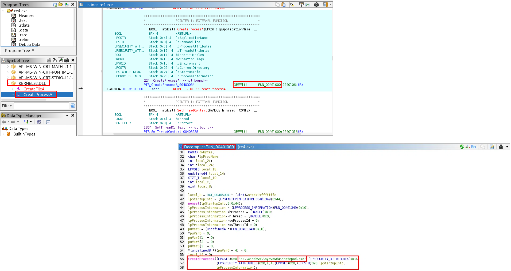
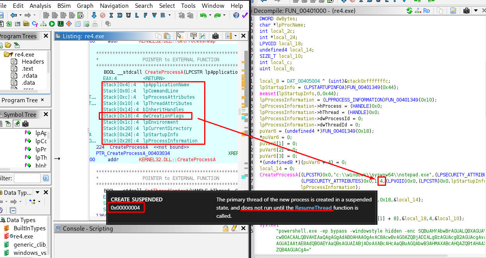
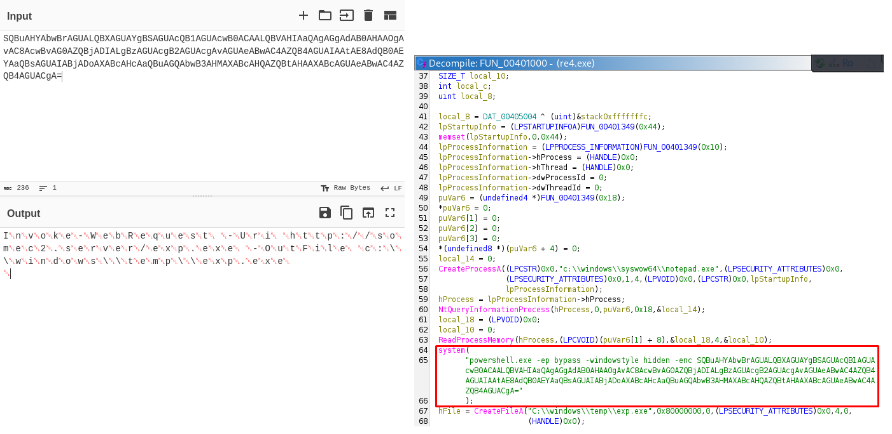
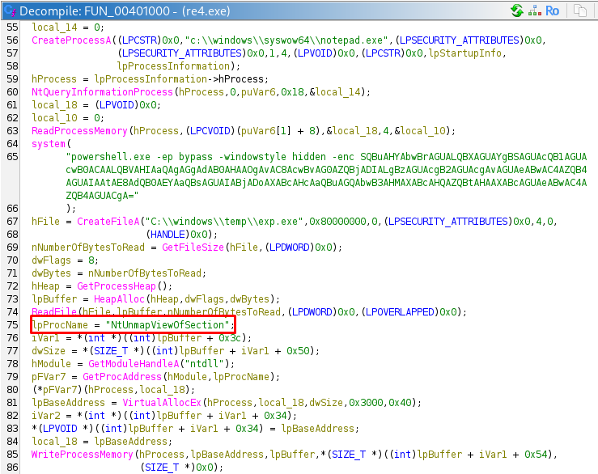
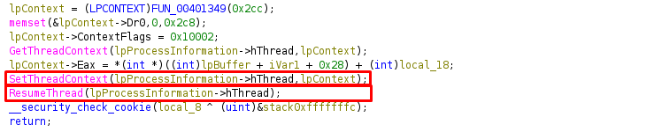
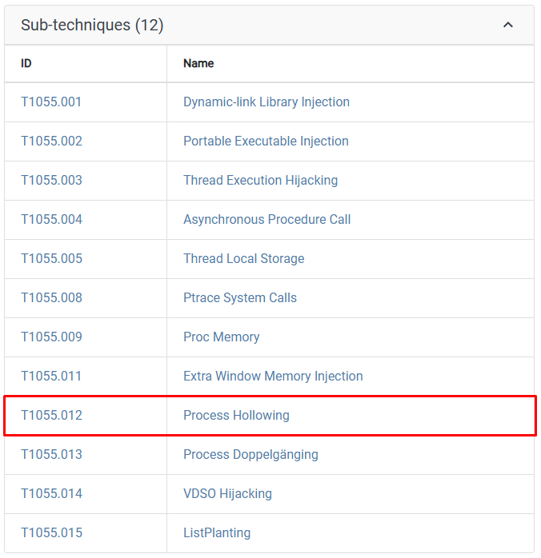

# Injection Series Part 4 | Blue Team Labs Online

**Type:** Reverse Engineering
**Investigator:** *Samir Aliguliyev*
**Status:** ✅ Complete

---

## Scenario

Reverse engineer the given malware sample and understand its behavior. Any disassembler can be used to complete this challenge.

## Tools Used

| Tool | Purpose |
|------|---------|
| **Ghidra** | Disassembly and decompilation of the sample |

---

## Findings - Q&A

### 1. Initial Process Creation

**Q: What is the process that would be first spawned by the sample? And what is the API used?**

In `Symbol Tree → Imports → KERNEL32.DLL`, the function `CreateProcessA` was found. Following its XREF led to `FUN_00401000`, where the decompiled code shows the actual call:

```c
CreateProcessA((LPCSTR)0x0, "c:\\windows\\syswow64\\notepad.exe", ...);
```

**A:** `notepad.exe, CreateProcessA`



---

### 2. CreateProcessA Flag

**Q: The value 4 has been pushed as a parameter to this API, what does that denote?**

Matching the pushed parameters against the `CreateProcessA` signature, the value `4` corresponds to the `dwCreationFlags` parameter. Checking Microsoft's documentation, `0x00000004` is `CREATE_SUSPENDED` - the process is created but its main thread is paused before any code runs.

This is an early sign of **process hollowing**: the malware creates a legitimate process in a suspended state so it can later replace its memory with malicious code before it ever executes.

**A:** `CREATE_SUSPENDED`



---

### 3. C2 Domain

**Q: What is the domain that the malware tries to connect?**

Inside `FUN_00401000`, the sample runs a hidden PowerShell command (`-windowstyle hidden -enc <base64>`). Decoding the base64 string (via CyberChef, treating it as UTF-16LE since PowerShell's `-enc` flag encodes payloads that way) reveals the actual command, which downloads a file from `http://somec2.server/exp.exe` and saves it locally as `exp.exe`.

**A:** `somec2.server`



---

### 4. Download Cmdlet and File Path

**Q: What is the cmdlet used to download the file and what is the path of the file stored?**

From the same decoded PowerShell command found in the previous question, the cmdlet `Invoke-WebRequest` is used to download the file, which is then saved to `C:\Windows\Temp\exp.exe`.

**A:** `Invoke-WebRequest, C:\Windows\Temp\exp.exe`

---

### 5. Dynamically Loaded ntdll Function

**Q: Just after the file download instructions, a function from ntdll has been loaded and invoked by the sample. What is the function name?**

Continuing through the decompiled code of `FUN_00401000`, right after the downloaded `exp.exe` is read into memory (`CreateFileA` + `ReadFile`), the sample resolves a function dynamically instead of importing it normally: it calls `GetModuleHandleA("ntdll")` followed by `GetProcAddress` with the string `"NtUnmapViewOfSection"`, then invokes the returned function pointer directly.

**A:** `NtUnmapViewOfSection`



---

### 6. Entry Point Update and Thread Resume

**Q: After the allocation of memory and writing the data into the allocated memory, what are the 2 APIs used to update the entry point and resume the thread?**

Since the process was created with `CREATE_SUSPENDED`, it must be explicitly resumed to run. Before resuming, the sample calls `SetThreadContext` to overwrite the thread's context - including the entry point - so it points to the malicious code just written into memory. It then calls `ResumeThread`, which resumes the paused thread and causes it to start executing the injected code instead of the original `notepad.exe` code.

**A:** `SetThreadContext, ResumeThread`



---

### 7. MITRE ATT&CK Technique

**Q: What is the MITRE ID for this technique implemented in this sample?**

The full chain observed in this sample - creating a process suspended (`CreateProcessA` + `CREATE_SUSPENDED`), unmapping its original memory (`NtUnmapViewOfSection`), allocating and writing new code (`VirtualAllocEx` + `WriteProcessMemory`), then redirecting execution and resuming it (`SetThreadContext` + `ResumeThread`) - matches the **Process Hollowing** sub-technique under Process Injection in MITRE ATT&CK.

**A:** `T1055.012`



---
