# SOAR + EDR Lab - LimaCharlie + Tines

## Overview

Home lab for practicing automated incident response using a real
EDR platform (LimaCharlie) integrated with a SOAR tool (Tines).
The scenario covers the full detection-to-response cycle: endpoint
telemetry, custom detection rules, automated analyst notification,
and human-in-the-loop isolation decision.

---

## Lab Topology

| Host        | Role                              |
|-------------|-----------------------------------|
| Windows 11  | Victim - LimaCharlie EDR Agent    |
| LimaCharlie | EDR - detection and response      |
| Tines       | SOAR - playbook orchestration     |
| Slack       | Analyst notification channel      |
| Email       | Analyst notification channel      |

---

## Tools

| Tool            | Role                                              |
|-----------------|---------------------------------------------------|
| **LimaCharlie** | EDR agent, detection rules, host isolation        |
| **Tines**       | SOAR playbook - notification and decision routing |
| **LaZagne**     | Credential harvesting tool (attacker-side)        |
| **Slack**       | Alert delivery and isolation status updates       |
| **Email**       | Alert delivery                                    |

---

### LaZagne Detection + Automated Response

**Goal:** detect execution of a credential harvesting tool (LaZagne)
on the Windows endpoint using a custom LimaCharlie detection rule,
then automate analyst notification and host isolation decision via
a Tines playbook.

**Attacker host:** Windows 11 - tool executed
locally to simulate a post-exploitation credential access attempt.

---

**Initial observation - LimaCharlie process telemetry:**
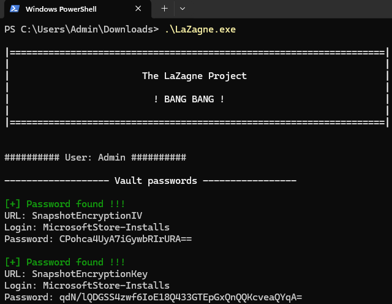
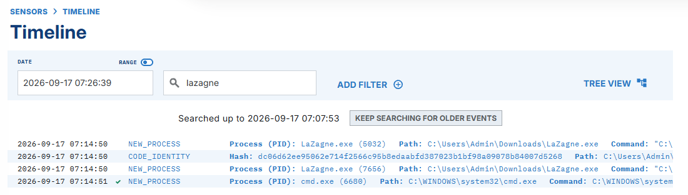

LimaCharlie was installed as an EDR agent on the Windows 11 host.
When `lazagne.exe` was executed, LimaCharlie immediately captured
the new process creation event, logging the image path, command
line, and associated metadata. Running LaZagne with the `all`
flag is also visible in the command line field of the process logs.

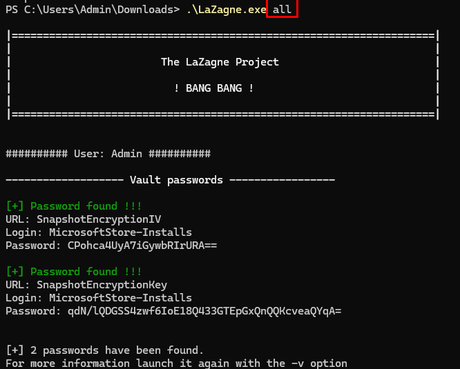
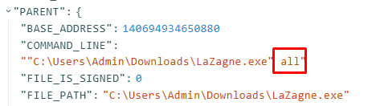

---

**Custom detection rule:**
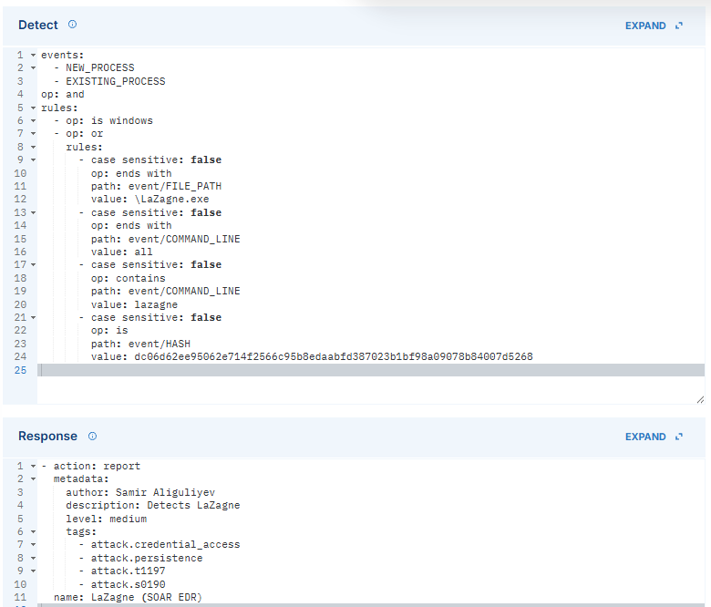

By default, LimaCharlie does not alert on LaZagne out of the box.
A custom Detect & Response rule was written to cover multiple
detection vectors - file path, command line content, and file hash:

```yaml
events:
  - NEW_PROCESS
  - EXISTING_PROCESS
op: and
rules:
  - op: is windows
  - op: or
    rules:
      - case sensitive: false
        op: ends with
        path: event/FILE_PATH
        value: \LaZagne.exe
      - case sensitive: false
        op: ends with
        path: event/COMMAND_LINE
        value: all
      - case sensitive: false
        op: contains
        path: event/COMMAND_LINE
        value: lazagne
      - case sensitive: false
        op: is
        path: event/HASH
        value: dc06d62ee95062e714f2566c95b8edaabfd387023b1bf98a09078b84007d5268
```

The rule triggers on `NEW_PROCESS` and `EXISTING_PROCESS` events and
matches any of the following conditions: the executable path ends
with `LaZagne.exe`, the command line contains `lazagne` or ends
with `all`, or the file hash matches the known LaZagne SHA256.
Using `op: or` across multiple fields ensures the rule is
resistant to simple renaming of the binary.

**Response rule:**

```yaml
- action: report
  metadata:
    author: Samir Aliguliyev
    description: Detects LaZagne
    level: medium
    tags:
      - attack.credential_access
  name: LaZagne (SOAR EDR)
```

The response action reports the detection with `medium` severity. The `report`
action surfaces the detection in LimaCharlie's detection feed and
makes it available for downstream integrations.

**Detection confirmed:**
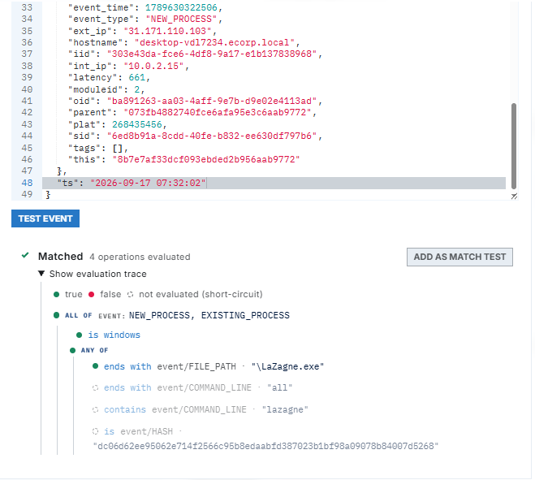
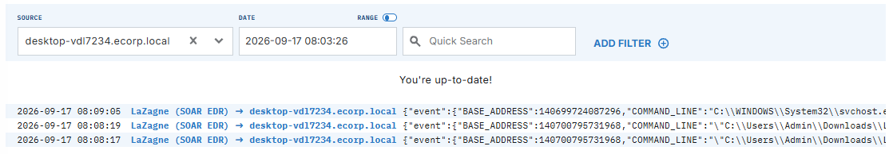

After saving the rule, re-running LaZagne triggered the detection
as expected - the alert appeared in LimaCharlie's detection feed
with all the expected metadata.

---

**Automation - SOAR Playbook (Tines):**

The automation layer connects LimaCharlie to Tines via a webhook,
routing every detection through a structured response playbook
rather than relying on manual analyst triage.

**Step 1 - Webhook integration:**
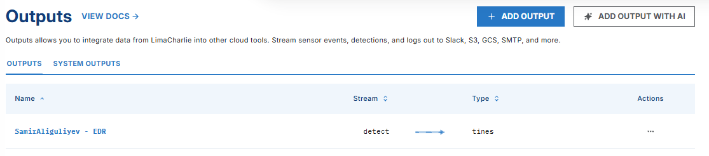
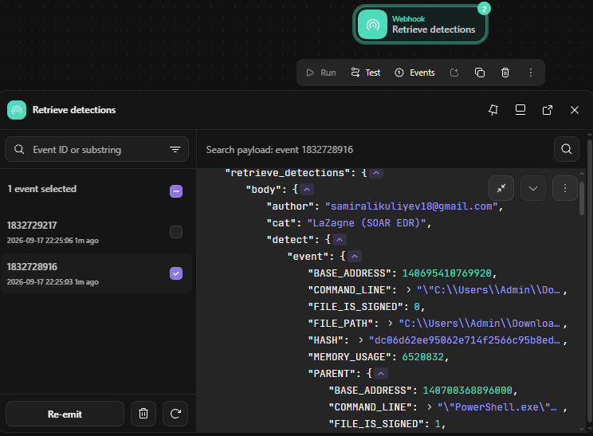

LimaCharlie was configured to forward all detections to a Tines
webhook. Every time the LaZagne rule fires, the full detection
payload (event time, hostname, source IP, username, file path,
command line, sensor ID, and detection link) is pushed to Tines
automatically.

**Step 2 - Analyst notification (Slack + Email):**
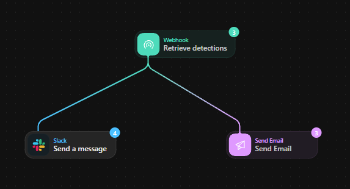
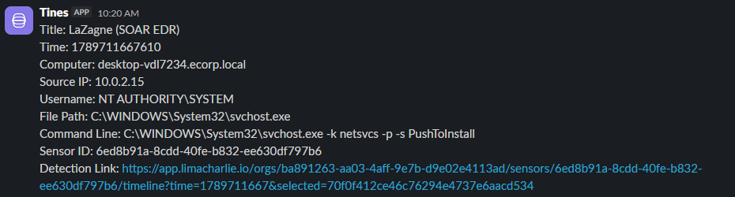
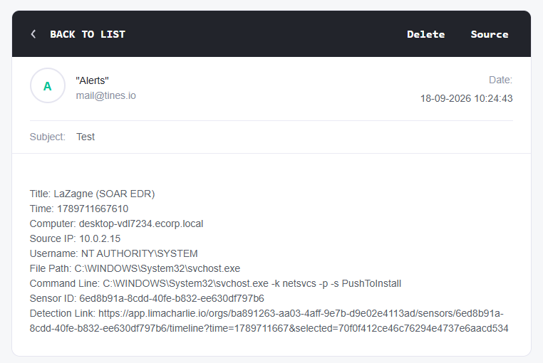

Tines sends the detection details simultaneously to a Slack channel
and via email, giving the analyst immediate visibility with all the
context needed to make a response decision.

**Step 3 - Human-in-the-loop isolation prompt:**
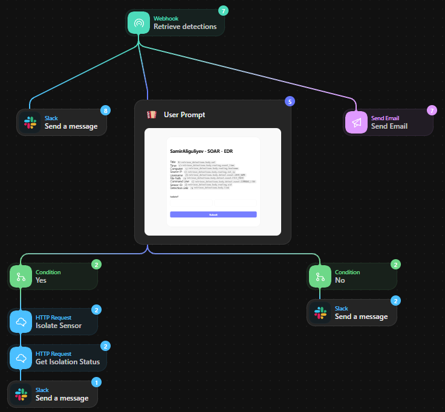
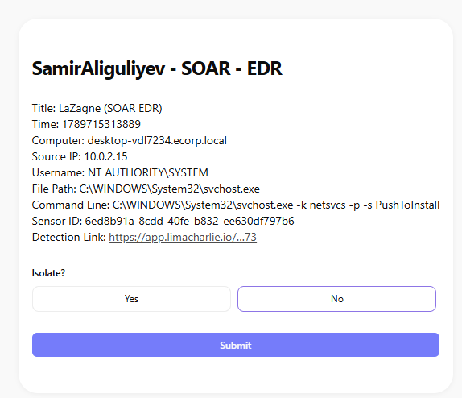

Tines presents the analyst with an interactive prompt asking
whether to isolate the affected machine. The prompt surfaces the
same detection details (computer name, source IP, process, command
line, file path, sensor ID, detection link) alongside a binary
choice: **Yes** or **No**.

**Step 4 - Conditional response:**
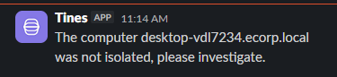
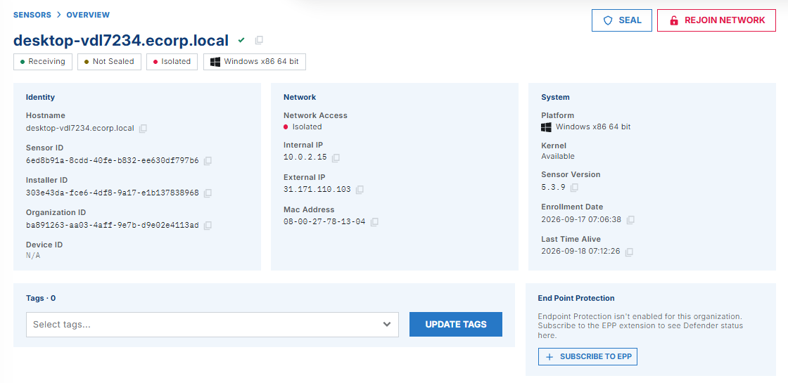
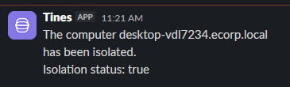


Based on the analyst's decision, Tines routes the playbook to one
of two outcomes:

- **Yes -> isolate:** Tines instructs LimaCharlie to isolate the
  host, cutting it off from the network. A confirmation is sent
  to Slack:
  > *"The computer desktop-vdl7234.ecorp.local has been isolated.
  > Isolation status: true"*

- **No -> do not isolate:** Tines sends a follow-up message to
  Slack flagging the machine for manual investigation:
  > *"The computer desktop-vdl7234.ecorp.local was not isolated,
  > please investigate."*

---

**Analysis:**

This scenario demonstrates a full Detection > Notification >
Decision > Response cycle without any manual steps beyond the
analyst's isolation choice. The combination of LimaCharlie's
multi-vector detection rule (path, command line, hash) with
Tines orchestration reduces mean time to respond and ensures
a consistent, documented process regardless of which analyst
handles the alert. The human-in-the-loop isolation prompt
intentionally preserves analyst control over the most impactful
action (taking a machine offline), while all notification and
routing steps are fully automated.

**Lessons learned:**
LimaCharlie's default ruleset does not flag LaZagne - writing
a custom rule was necessary and highlighted the importance of
tuning EDR rules beyond out-of-the-box coverage. Using multiple
detection conditions (`op: or` across file path, command line,
and hash) makes the rule more resilient to simple evasion
techniques like binary renaming.