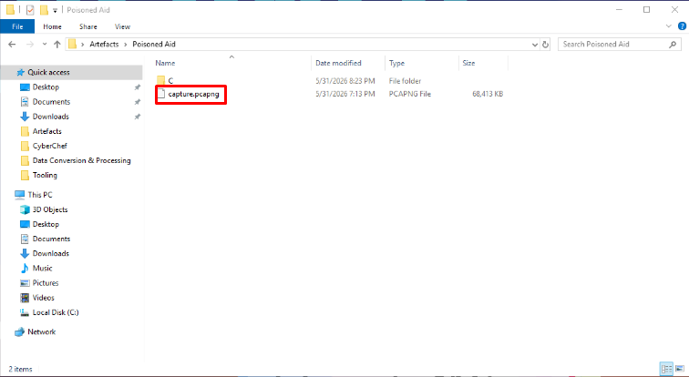
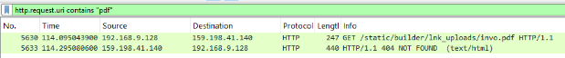
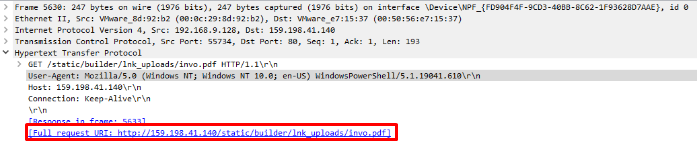
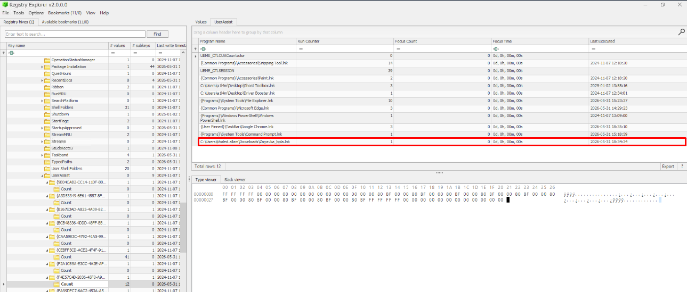
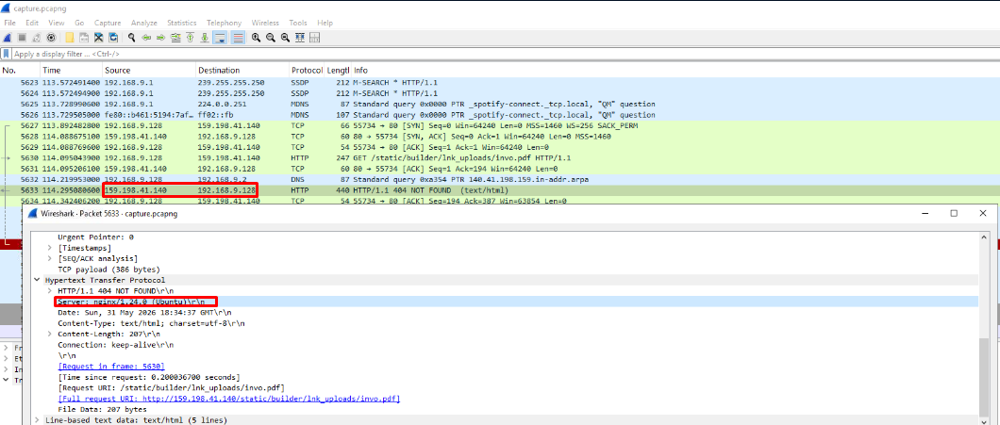
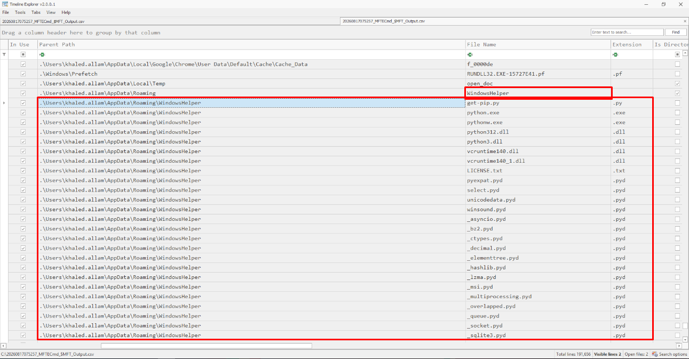
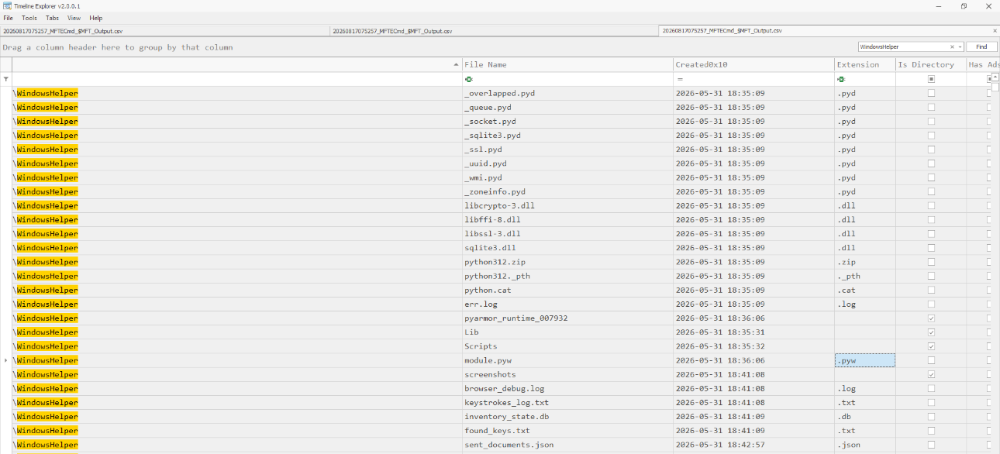
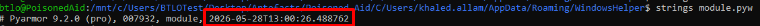
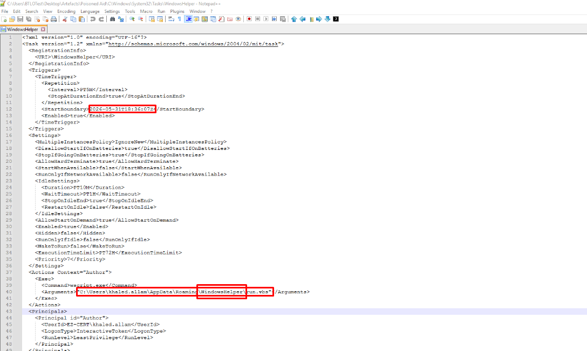
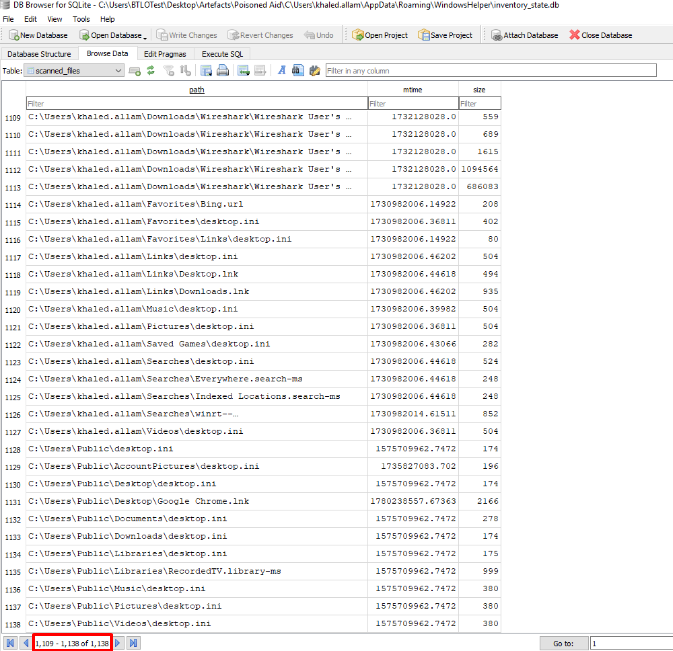

# Humanitarian Aid Phishing | EZ-CERT Incident Response
**Challenge:** [Add challenge name / link here]
**Type:** Incident Response
**Investigator:** *Samir Aliguliyev*
**Status:** 🟡 In Progress
---

## Scenario
Khaled, an employee at EZ-CERT, received what appeared to be a legitimate email containing information about an ongoing humanitarian aid initiative. Believing the attachment was a harmless aid coordination document, he downloaded and opened the file on his corporate workstation. Shortly afterward, the Security Operations Center identified suspicious activity originating from Khaled's endpoint, including unusual network connections and signs of potential unauthorized execution. Concerned that the incident may involve more than a simple phishing attempt, the incident response team acquired a triage image of Khaled's machine to preserve forensic artifacts. As the assigned investigation team, the objective is to analyze the triage image, identify any malicious payloads or persistence mechanisms, and establish a full timeline of compromise to assess the true scope, impact, and intent of this attack.

---

## Tools Used
| Tool | Purpose |
|------|---------|
| *KAPE* | Triage collection |
| *Wireshark* | Analyze the .pcapng network capture, filter HTTP requests |
| *Registry Explorer* | *Parse and inspect NTUSER.DAT / registry hives* |
| *MFTECmd* | *Parse $MFT into a readable CSV timeline* |
| *Timeline Explorer* | *Review parsed $MFT timeline, filter around key timestamps* |

---

## Findings - Q&A

**Q1: Khaled received what looked like a routine email about a humanitarian aid initiative and opened the attachment without hesitation. The moment he did, the malware moved to keep him distracted — it fetched and opened a decoy document to mask what was actually happening in the background. What was the full URL of that decoy PDF?**

Opening the KAPE triage collection, there is a .pcapng file located next to the C folder. Opening it in Wireshark and applying the filter http.request.uri contains ".pdf" immediately surfaces a request for invo.pdf. Inspecting the packet details reveals the full source address the PDF was downloaded from.

**A:** *http://159.198.41.140/static/builder/lnk_uploads/invo.pdf*

---

**Q2: Pinning down the exact moment of compromise is critical for scoping the incident. At what time did Khaled open the malicious file?**

To determine when the user opened the file through the GUI, I first checked $MFT and $J, but found nothing useful there. I then opened the NTUSER.DAT registry hive in Registry Explorer, specifically the UserAssist key, and found a suspicious .lnk entry corresponding to the execution.

**A:** *2026-05-31 18:34:34*

---

**Q3: The infrastructure behind this campaign wasn't improvised. Identifying the attacker's web server gives us a fingerprint of the tooling they chose to operate with. What web server was the attacker running?**

Looking at the same .pcapng file in Wireshark, opening the details of the HTTP response from 159.198.41.140 reveals the Server header, disclosing the exact web server software and version in use.

**A:** *nginx/1.24.0*

---

**Q4: Rather than scattering files across the filesystem, the attacker chose to operate cleanly — everything was dropped into a single self-contained directory designed to blend in with legitimate Windows paths. What is the full path of that staging directory?**

Parsing $MFT with MFTECmd and opening the output in Timeline Explorer, I filtered around 2026-05-31 18:34:34 (the moment the malicious file was opened). Right at that timestamp, a new WindowsHelper directory is created, into which several Python files are written — almost certainly the C2 components dropped by the malware.

**A:** *C:\Users\khaled.allam\AppData\Roaming\WindowsHelper*

---

**Q5: The staging directory was intentionally packed with legitimate-looking files as cover — a classic noise technique. Buried among them, however, was the one file that actually did the damage. What is the name of the malicious module?**

Continuing to review the $MFT timeline in Timeline Explorer, after the default Python distribution files were dropped, about a minute later at 18:36:06 a pyarmor_runtime file is created — used to obfuscate Python code, which is already suspicious. At that exact same second, module.pyw is also created. Together, these files are almost certainly used for malicious purposes.

**A:** *module.pyw*

---

**Q6: Compiling obfuscation timestamps helps establish when this campaign was being built. When was the malicious module obfuscated?**

Running strings module.pyw, the very beginning of the output reveals a PyArmor-embedded timestamp corresponding to when the module was obfuscated.

**A:** *2026-05-28 13:00:26.488*

---

**Q7: Before the attacker did anything else on Khaled's machine, they made sure their payload stayed active — even if the process was killed or the machine rebooted. When exactly was the persistence mechanism implanted?**

I first checked the Run/RunOnce keys in the NTUSER.DAT registry hive, but found nothing there. I then checked C:\Windows\System32\Tasks and found a scheduled task named WindowsHelper. Since the files inside the WindowsHelper directory are known to be malicious, this task is highly suspicious. Opening the task shows it launches the scripts from inside WindowsHelper, along with the task's creation time.

**A:** *2026-05-31 18:36:07*

---

**Q8: The module quietly crawled Khaled's directories, targeting documents, config files, and credential stores while deliberately skipping system folders and low-value file types. It also tracked what it had already seen to avoid re-uploading unchanged content. How many files did it scan in total?**

To figure out where this tracking data might be stored, I opened the WindowsHelper directory and found a file named inventory_state.db. Opening it revealed a large number of entries — full paths and metadata for files belonging to khaled.allam — which the module used to keep track of what had already been scanned. Counting the entries in this database gives the total number of files scanned.

**A:** *1138*

---

**Q9: Looking at the PCAP, a significant volume of data left Khaled's machine without authorization. What was the total size of the exfiltrated data in megabytes?**
**A:** *Answer pending.*

---

**Q10: Every file Khaled unknowingly handed over was sent to a specific endpoint on the attacker's server. What endpoint was used to receive the exfiltrated files?**
**A:** *Answer pending.*

---

**Q11: Among everything the infostealer quietly harvested in the background, it captured clipboard data containing credentials for Khaled's password manager — giving the attacker direct access to his most sensitive accounts. What email and master password did the attacker obtain to access the password manager?**
**A:** *Answer pending.*

---

## Timeline of Compromise
*To be compiled once all findings are confirmed — chronological summary of initial access, decoy execution, staging, persistence, discovery/harvesting, and exfiltration.*

## Summary / Impact
*To be written after all questions are answered — overview of attack chain, scope, and business impact.*