# 🔍 Case 01 - Geek Squad Phishing → Remote Access → C2 Compromise

**Date of Incident:** 2024-05-15

**Type:** Phishing / Tech Support Scam / Remote Access Trojan / C2 Beacon

**Collection Method:** KAPE Triage

**Investigator:** *Samir Aliguliyev*

**Status:** ✅ Complete

---

## 📋 Table of Contents

1. [Scenario](#scenario)
2. [Investigation Methodology](#investigation-methodology)
3. [Tools Used](#tools-used)
4. [Findings - Q&A](#findings--qa)
5. [MITRE ATT&CK Mapping](#mitre-attck-mapping)
6. [Lessons Learned](#lessons-learned)

---

## Scenario

A user self-reported receiving a suspicious email on **15 May 2024** claiming she was being charged for a **Geek Squad subscription renewal**. She never had such a subscription.

The email warned she had 24 hours to cancel. She called the listed number and was instructed to:
1. Visit a website
2. Download software granting remote access to her computer - supposedly to "remove Geek Squad access software"

She complied. ~30–45 minutes later, a co-worker urged her to report it to the SOC immediately.

**SOC Response:** System was taken offline and a triage collection was performed using **KAPE**. The user was **not connected to VPN** during the event - no SIEM data or PCAP available. Investigation is **artifact-only**.

---

## Investigation Methodology

```
KAPE Collection
      │
      ├── Browser Artifacts     → BrowsingHistoryView, Hindsight
      ├── Registry Hives        → Registry Explorer, RegRipper, ShellBags Explorer
      ├── Prefetch Files        → PECmd → execution evidence
      ├── $MFT / File System    → MFTECmd → Timeline Explorer
      ├── Event Logs            → Event Log Explorer (Sysmon, Security, Defender)
      └── Scheduled Tasks / Run Keys → persistence mechanisms
```

---

## Tools Used

| Tool | Purpose |
|------|---------|
| **KAPE** | Triage collection |
| **Registry Explorer** | Parse registry hives (NTUSER.DAT, SOFTWARE) |
| **RegRipper** | Extract UserAssist, Run keys, execution artifacts |
| **ShellBags Explorer** | Parse shellbags for folder access history |
| **MFTECmd** | Parse $MFT for file timeline |
| **Timeline Explorer** | Visualize and filter MFT/event timelines |
| **BrowsingHistoryView** | Browser history analysis |
| **Hindsight** | Chrome/Edge browser artifact analysis |
| **EZViewer** | View parsed artifact files (CSV, JSON) |
| **Event Log Explorer** | Windows event log analysis (Sysmon, Security, Defender) |

---

## Findings - Q&A

### 1. User & System Profile

**Q: What user profile was used during this event?**
> 🔍 *Artifact: Registry - ProfileList*
**A:** `Vickey`

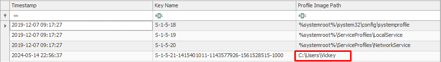

---

**Q: Is prefetch enabled on the system?**
**A:** `Yes`

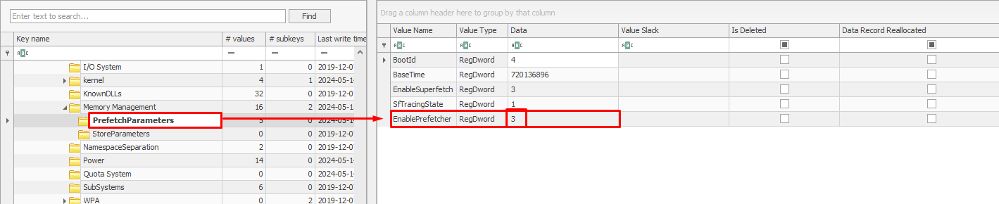

---

### 2. Browser & Email Forensics

**Q: What browser does the user primarily use?**
**A:** `Google Chrome`

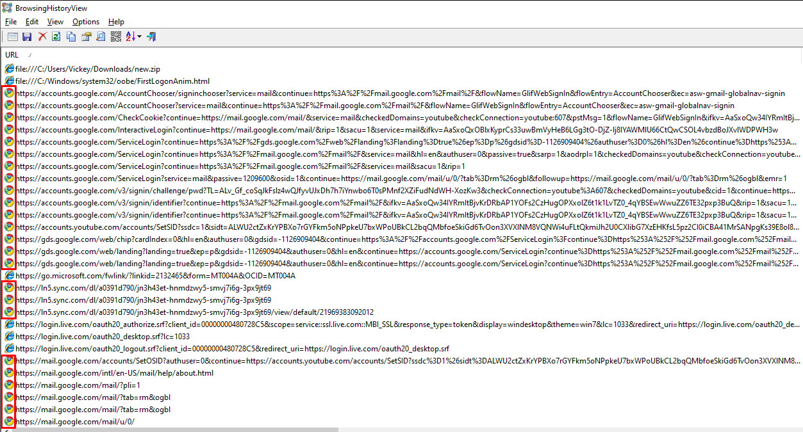

---

**Q: What webmail service did the user use?**
**A:** `Gmail`


---

**Q: What email address was the user using?**
**A:** `8ugz.mail@gmail.com`


---

**Q: What is the name of the email attachment the user downloaded?**
**A:** `new.zip`

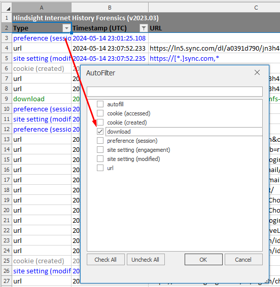
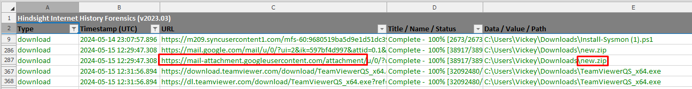

---

**Q: What is the name of the .zip file accessed at 2024-05-15 12:30:10?**
**A:** `new.zip`

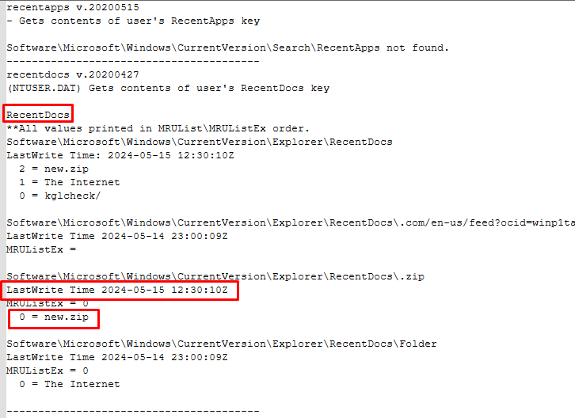

---

**Q: How did the user access espn.com?**
**A:** `Link`

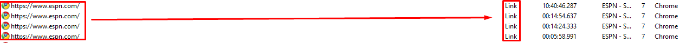

---

**Q: What ransomware family did CISA report on in the article on Bleeping Computer?**
**A:** `Black Basta`

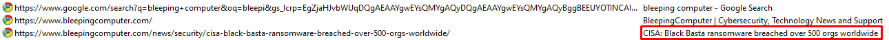

---

### 3. Remote Access & Malware

**Q: What tool did the user download?**
**A:** `TeamViewer`

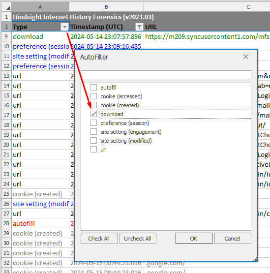
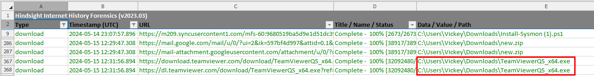

---

**Q: How did the user initially access the site for the remote management tool?**
**A:** `Typed URL`

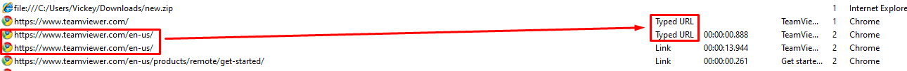

---

**Q: What time was TeamViewer executed?**
> 🔍 *Artifact: NTUSER.DAT - UserAssist (parsed via RegRipper)*
**A:** `2024-05-15 12:32:11`

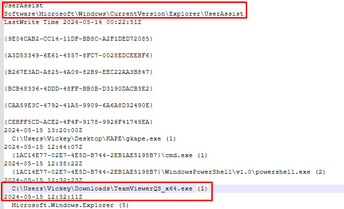

---

**Q: What time did the TeamViewer session end?**
**A:** `2024-05-15 12:47:40.553`

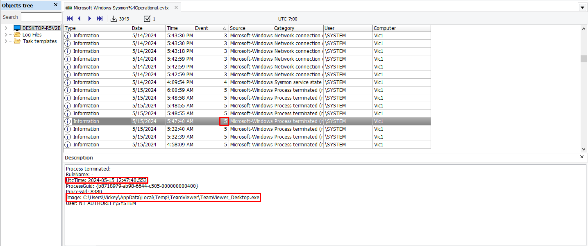

---

**Q: What did the malicious actor disable shortly after making the remote connection?**
**A:** `Microsoft Defender Antivirus Real-time Protection`

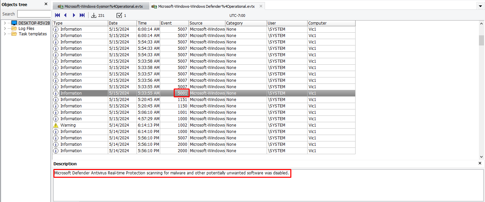

---

**Q: What was the name of the malware that was restored from quarantine?**
**A:** `VirTool:Win32/Sliver.D!MTB`

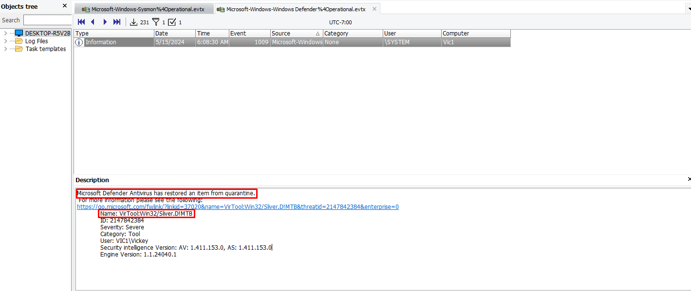

---

### 4. Persistence Mechanism

**Q: Is there a persistence mechanism?**
**A:** `Yes`

**Q: If yes, what is the flag for the persistence mechanism?**
> 🔍 *Artifact: NTUSER.DAT - Software\Microsoft\Windows\CurrentVersion\Run (Registry Explorer)*
**A:** `FLAG061`

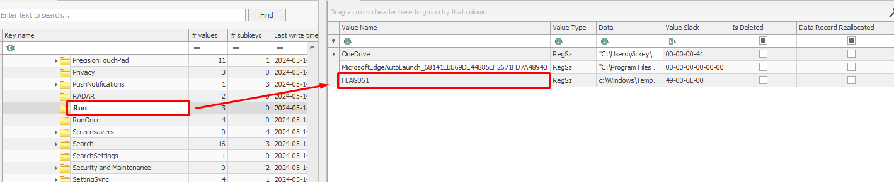

---

### 5. C2 & Network Activity

**Q: Was command and control beacon established?**
**A:** `Yes`

**Q: If C2 was established, what is the name of the beacon?**
**A:** `COURAGEOUS_DRAGSTER.exe`

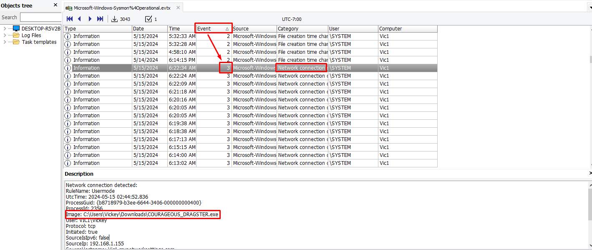

---

**Q: What executable was used to download the C2 beacon?**
**A:** `certutil.exe`

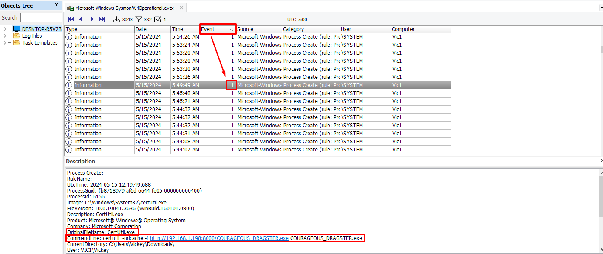

---

**Q: What IP address was FLAG734 downloaded from?**
**A:** `192.168.1.198`

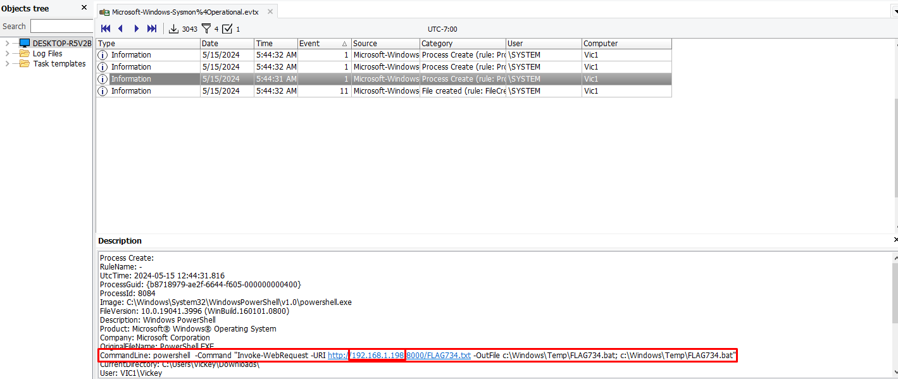

---

**Q: What is the file path for where FLAG734 was downloaded to?**
**A:** `C:\Windows\Temp`

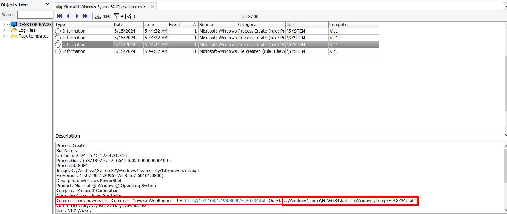

---

**Q: What port number did the reverse shell use?**
**A:** `1337`

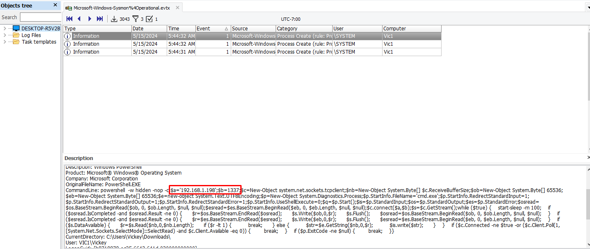

---

**Q: What is the IP address for raw.githubusercontent.com?**
**A:** `185.199.108.133`

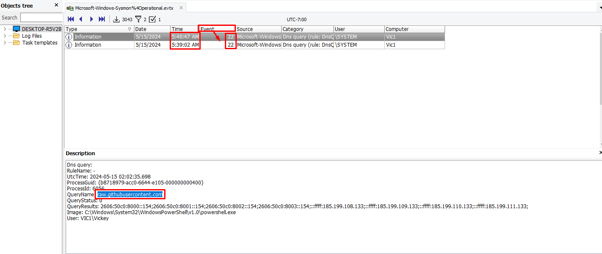
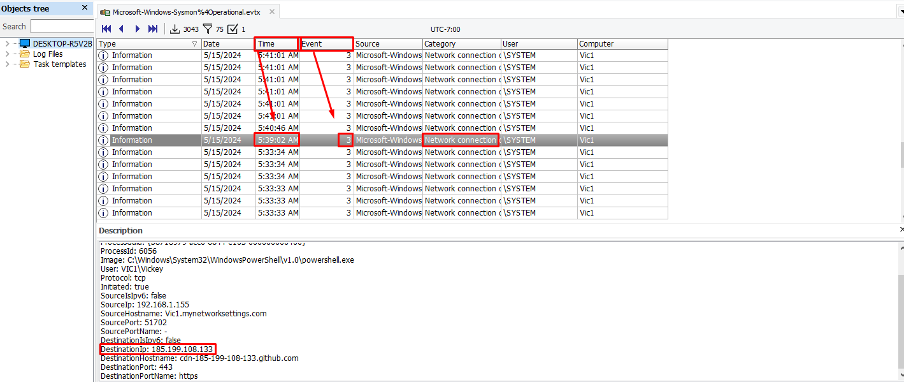

---

### 6. Enumeration Commands

**Q: What enumeration command was executed at 2024-05-15 12:45:21.857 (UTC)?**
**A:** `whoami`

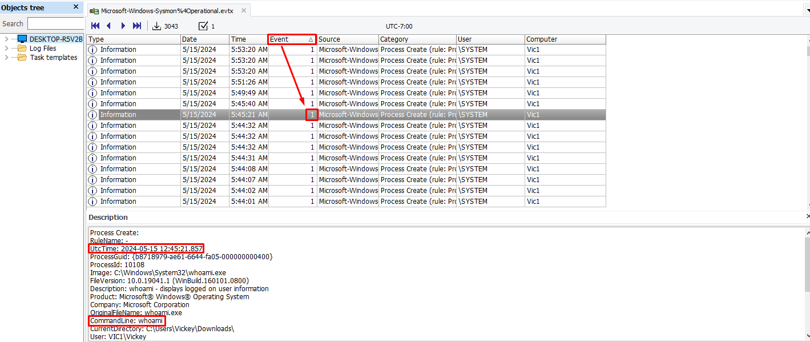

---

**Q: What enumeration command was executed at 2024-05-15 12:45:40.962 (UTC)?**
**A:** `ipconfig`

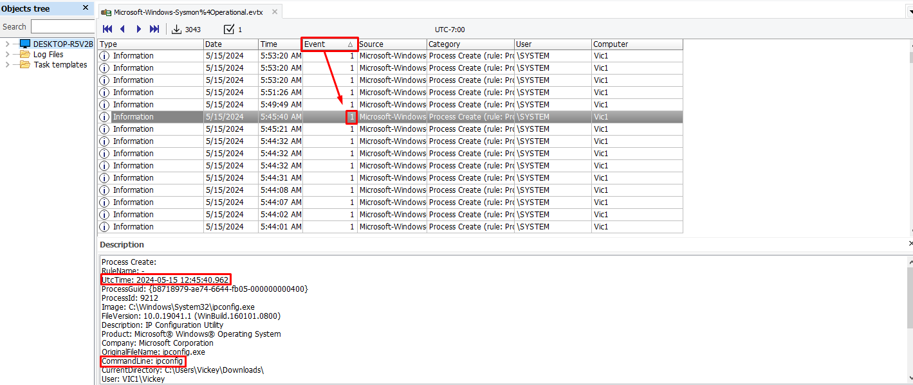

---

### 7. CTF Flags

**Q: What was the flag placed in the Downloads folder at 2024-05-15 12:36:40.830 (UTC)?**
**A:** `FLAG007`

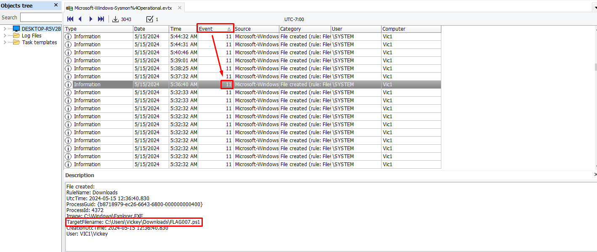

---

**Q: What was the flag downloaded to the Downloads folder at 2024-05-15 12:39:01.615 (UTC)?**
**A:** `FLAG714`

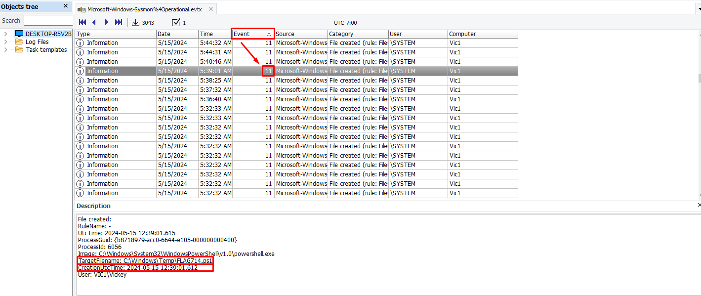

---

**Q: What is the flag in the Temp directory that was last accessed at 2024-05-15 12:43:32?**
**A:** `FLAG099`

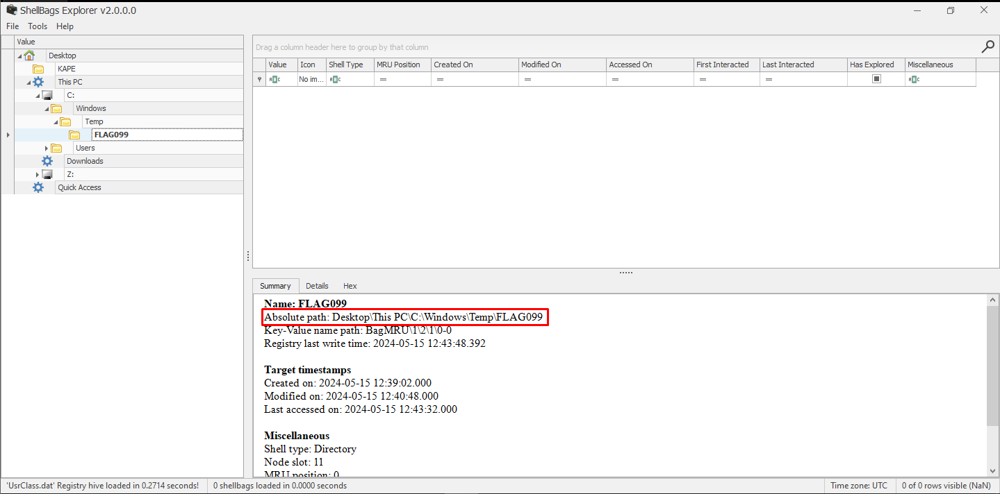

---

## MITRE ATT&CK Mapping

| Tactic | Technique | ID | Evidence |
|--------|-----------|----|---------|
| Initial Access | Phishing - Spearphishing via Service | T1566.002 | Geek Squad renewal email with callback number |
| Execution | User Execution | T1204 | User downloaded and ran TeamViewer |
| Defense Evasion | Impair Defenses - Disable or Modify Tools | T1562.001 | Attacker disabled Microsoft Defender Real-time Protection |
| Defense Evasion | Impair Defenses - Restore from Quarantine | T1562 | `VirTool:Win32/Sliver.D!MTB` restored from Defender quarantine |
| Persistence | Boot or Logon Autostart - Registry Run Keys | T1547.001 | FLAG061 found in `HKCU\...\CurrentVersion\Run` |
| Discovery | System Owner/User Discovery | T1033 | `whoami` executed at 12:45:21 |
| Discovery | System Network Configuration Discovery | T1016 | `ipconfig` executed at 12:45:40 |
| Command & Control | Remote Access Software | T1219 | TeamViewer used for initial remote access |
| Command & Control | Ingress Tool Transfer | T1105 | `certutil.exe` used to download `COURAGEOUS_DRAGSTER.exe` |
| Command & Control | Non-Standard Port | T1571 | Reverse shell used port 1337 |

---

## Lessons Learned

### 🔴 Attacker Techniques Observed
- **Tech Support Scam** is a classic social engineering vector - urgency + fear drives victim compliance
- Attacker used **legitimate remote access software** (TeamViewer) to avoid initial AV detection
- **Defender was disabled immediately** after gaining access - first priority for the attacker
- `certutil.exe` - a legitimate Windows binary - was abused to download the C2 beacon (Living off the Land)
- C2 beacon (`COURAGEOUS_DRAGSTER.exe`) established persistent network communication via Sliver framework
- Malware was **restored from AV quarantine** - attacker had enough access to interact with Defender

### 🔵 Defensive Recommendations
- Block or alert on unknown remote access tools at endpoint (application allowlisting)
- Alert on `certutil.exe` making outbound network connections (LOLBAS abuse)
- Alert on AV quarantine restore events (Defender Event ID 1009)
- Alert on Defender Real-time Protection being disabled (Defender Event ID 5001)
- Require VPN for all corporate endpoints - would have enabled SIEM/PCAP visibility
- User awareness training focused on callback phishing (vishing)

### 🟡 Forensic Notes
- KAPE triage was effective even without network telemetry
- Sysmon Event ID 3 (Network Connection) was critical for identifying C2 activity
- `$MFT` timestamps established the precise attack timeline
- UserAssist registry key confirmed TeamViewer execution time
- Without Sysmon, many of these artifacts would not have been available
