## IDS Lab - Suricata + Zeek + tshark

Home lab for practicing SOC detection skills: identifying
network attacks at different layers - Suricata signatures, Zeek
metadata, and packet-level analysis with tshark. Each scenario is a
real attack run between the lab VMs, followed by alert and log
analysis.

---

## Lab Topology

| Host              | IP              | Role                              |
|-------------------|-----------------|-------------------------------------|
| Windows 11        | 192.168.56.103  | Normal host                         |
| Ubuntu Desktop    | 192.168.56.102  | Attacker                            |
| Ubuntu Server     | 192.168.56.101  | Sensor: Suricata + Zeek + tshark    |

All hosts sit on the same isolated VirtualBox network (host-only /
internal network). Traffic is mirrored through the interface
monitored by Suricata and Zeek.

---

## Tools

| Host              | IP              |
|-------------------|-----------------|
| **Suricata**        | IDS, alert mode  | 
| **Zeek**     | Network log generation  |
| **tshark**     | Packet capture and low-level traffic analysis |
| **nmap**     | attacker-side tool for reconnaissance scenarios |

---

##  Scenarios

| #  | Scenario                                                      | Status         |
|----|---------------------------------------------------------------|----------------|
| 01 | Nmap Reconnaissance  | ✅ Complete |
| 02 | SSH Brute-Force  | ✅ Complete |
| 03 | Malware C2 traffic  | In progress |

---

### Scenario 01 - Nmap Reconnaissance

**Goal:** detect port scanning and service version detection activity
from the attacker host.

**Attacker host:** Ubuntu Desktop (192.168.56.102)

**Attack commands:**

```bash
sudo nmap -sS -p- 192.168.56.101
```

**Before - no detection**

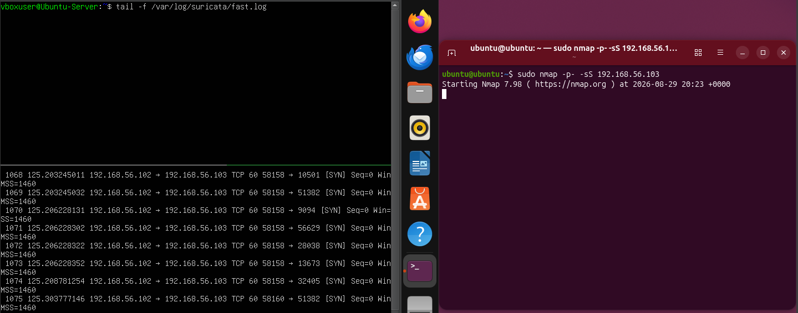

The screenshot below shows the initial state before any custom rule
was in place. The attacker (192.168.56.102) launches a
TCP SYN scan against the sensor.
tshark clearly captures the SYN packets hitting the target across
multiple ports, confirming the scan traffic is present on the wire -
but Suricata's fast.log stays empty. At this point Suricata had no
signature capable of matching this specific behavior, so the scan went
completely undetected despite being visible at the packet level.

**After - custom detection rule**

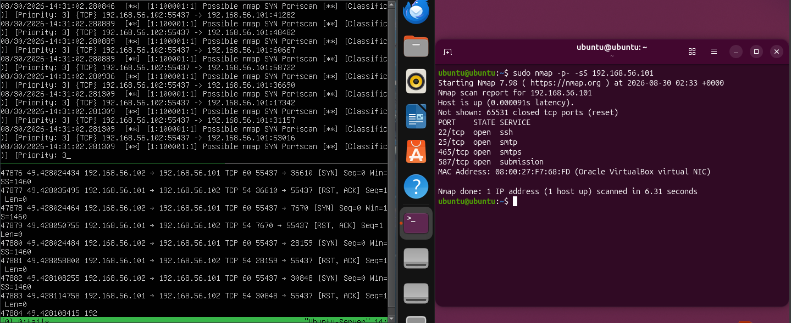

To close this gap, a custom rule was written to detect SYN-based port
scanning based on connection rate rather than a single packet:

```bash
alert tcp $EXTERNAL_NET any -> $HOME_NET any (msg:"Possible Nmap SYN Portscan"; tcp.flags:S; detection_filter: track by_src, count 30, seconds 5; sid:100001; rev:1;)
```

The rule triggers when a single source sends 30 or more SYN packets
within a 5-second window toward the protected network
($HOME_NET). Using detection_filter instead of alerting on every
single SYN packet reduces noise and avoids flooding the log with one
alert per port, while still reliably catching the scan as a pattern.
After reloading Suricata and re-running the same *nmap -sS -p-*
command, fast.log now shows the alert firing in real time,
confirming the detection gap identified before has been
closed.


### Scenario 02 - SSH Brute Force

**Goal:** detect repeated failed SSH authentication attempts against
the sensor, indicating a brute-force attack.

**Attacker host:** Ubuntu Desktop (192.168.56.102)

**Attack commands:**

```bash
hydra -t 4 -l admin -P /usr/share/wordlists/rockyou.txt ssh://192.168.56.101
```

**Before - no detection**

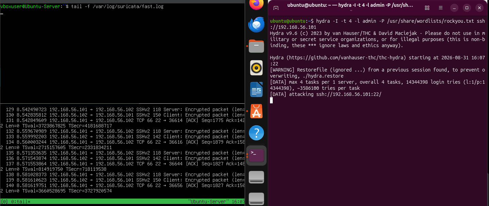

The screenshot below shows the initial state before any custom rule
was in place. The attacker (192.168.56.102) launches a Hydra
brute-force attack against the SSH service on the sensor, rapidly
attempting many username/password combinations. tshark captures the
repeated TCP connections to port 22, confirming the brute-force
traffic is present on the wire - but Suricata's fast.log stays empty.
At this point Suricata had no signature capable of matching this
specific behavior, so the attack went completely undetected despite
being visible at the packet level.

**After - custom detection rule**

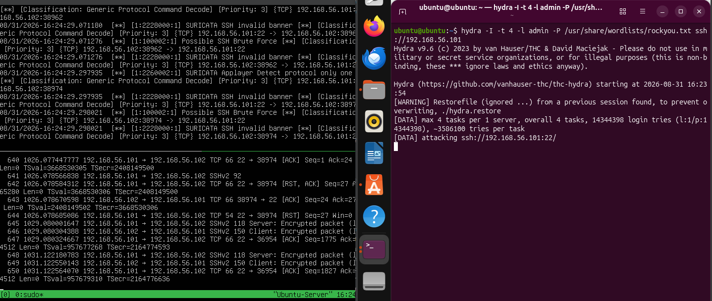

To close this gap, a custom rule was written to detect SSH
brute-forcing based on connection rate to port 22 rather than
inspecting individual packets:

```bash
alert tcp $EXTERNAL_NET any -> $HOME_NET 22 (msg: "Possible SSH Brute Force"; app-layer-protocol: ssh; detection_filter: track by_src, count 10, seconds 60; sid: 100002; rev: 1;)
```

The rule triggers when a single source sends 10 or more new
connection attempts to port 22 within a 60-second window toward the
protected network ($HOME_NET). Using detection_filter instead of
alerting on every single connection reduces noise from normal login
retries and avoids flooding the log with one alert per attempt, while
still reliably catching the sustained brute-force pattern. After
reloading Suricata and re-running the same *hydra* command, fast.log
now shows the alert firing in real time, confirming the detection gap
identified before has been closed.

---

### Scenario 03 — Malware C2 Traffic Analysis (pcap replay)

**Goal:** analyze a real-world malware pcap offline using Suricata and
Zeek to identify command-and-control activity, and validate
suspicious indicators against threat intelligence sources.

**Source:** pcap file obtained for offline traffic analysis.

**Suricata - no alerts triggered:**
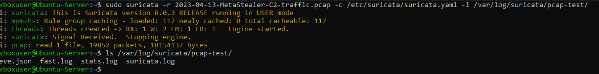
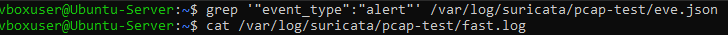

The pcap file was first run through Suricata to check for any signature-based
detections. As shown in the screenshot, no alerts were generated in
either `eve.json` or `fast.log`. This means none of the loaded ET
Open signatures matched the traffic in this capture, so the analysis
had to continue manually using Zeek.

**Feeding the pcap to Zeek:**
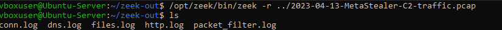

The same pcap was then processed offline with Zeek, generating a set of connection and protocol
logs for manual inspection.

**dns.log — suspicious domains identified:**
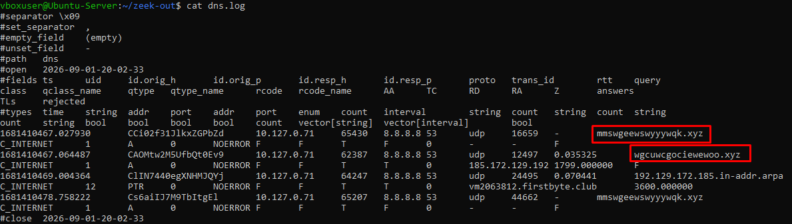
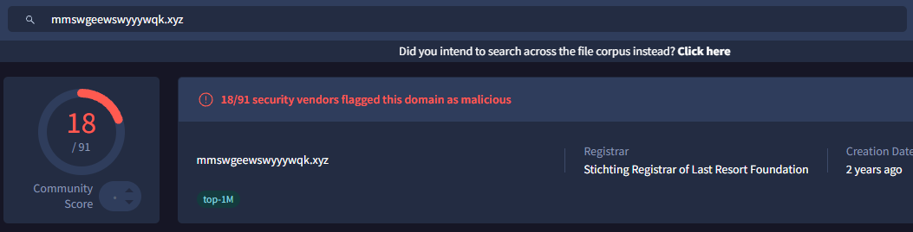
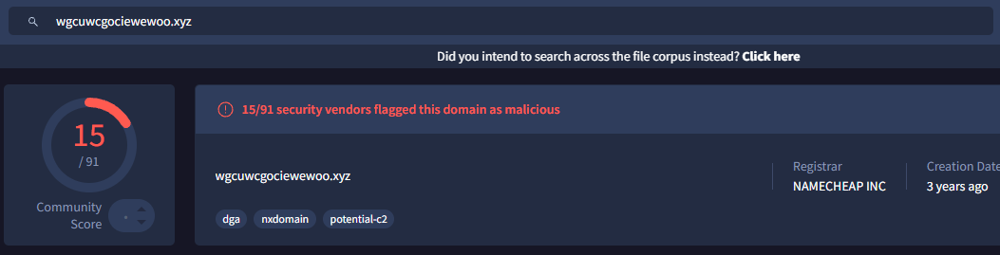

Reviewing `dns.log` revealed two suspicious domains being resolved
during the capture. Both stood out as unlikely to be legitimate
traffic based on their naming pattern and resolution behavior.

**conn.log — correlating the IP:**
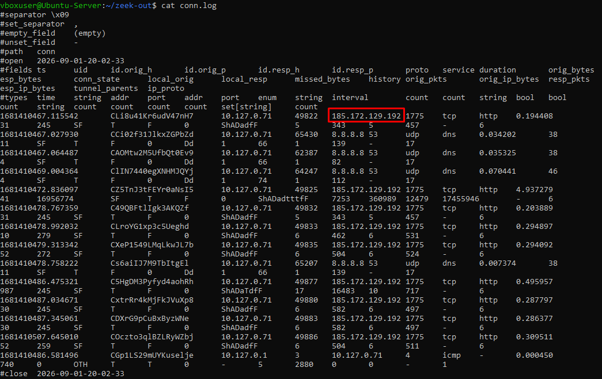

Cross-referencing `conn.log` surfaced a suspicious IP address
involved in the connections. Checking this IP against VirusTotal
confirmed it was associated with the two suspicious domains found
earlier in `dns.log`, tying the DNS activity directly to the
observed network connections.
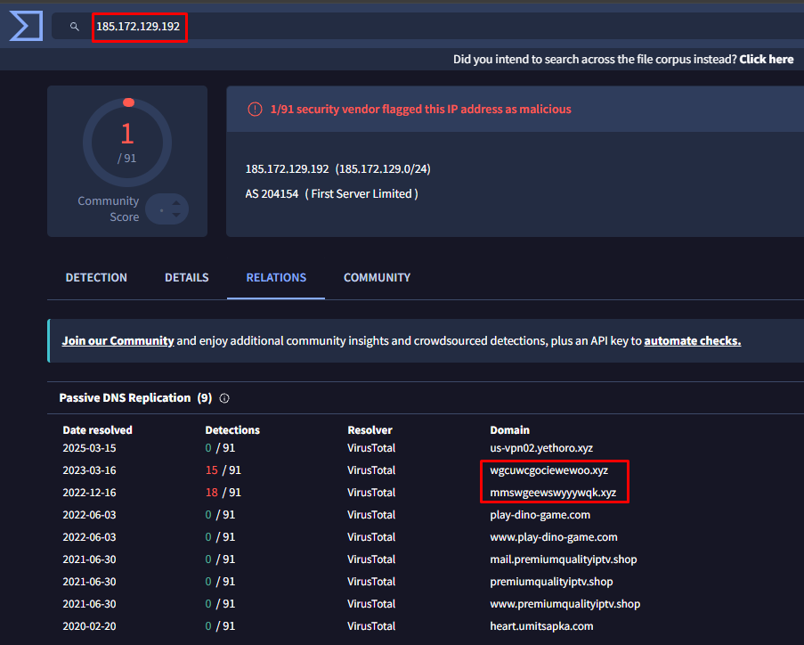

**Deep-dive - inspecting the HTTP streams in Wireshark:**
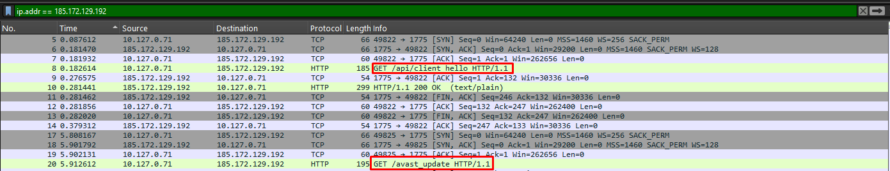

Filtering the pcap on the malicious IP and following the HTTP streams
revealed the actual C2 protocol in use. Two distinct request types
were observed:

- `GET /api/client_hello` — a short initial check-in, likely used by
  the malware to register with the C2 server.
- `GET /avast_update` — despite the name imitating a legitimate
  antivirus update (a common evasion technique to avoid raising
  suspicion in network monitoring), this request triggers a large
  multi-packet transfer, consistent with a stage-2 payload download.

Both requests share the same suspicious `Host` header
(`wgcuwcgociewewoo.xyz:1775` - a DGA-style domain on a non-standard
port) and the same `User-Agent: cpp-httplib/0.12.1`, a bare C++ HTTP
client library rather than a real browser - a strong indicator of
automated malware traffic rather than human browsing activity.
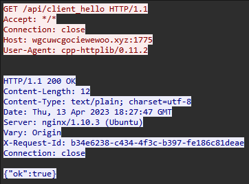

**Exfiltration / task-reporting requests:**
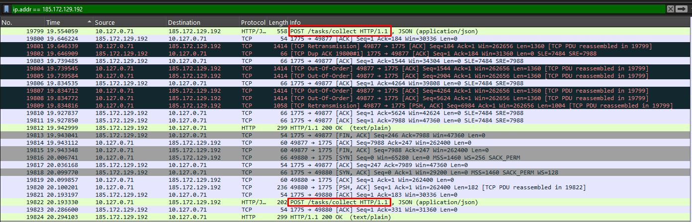

Later in the capture, several `POST /tasks/collect` requests were
observed being sent from the infected host back to the C2 server.

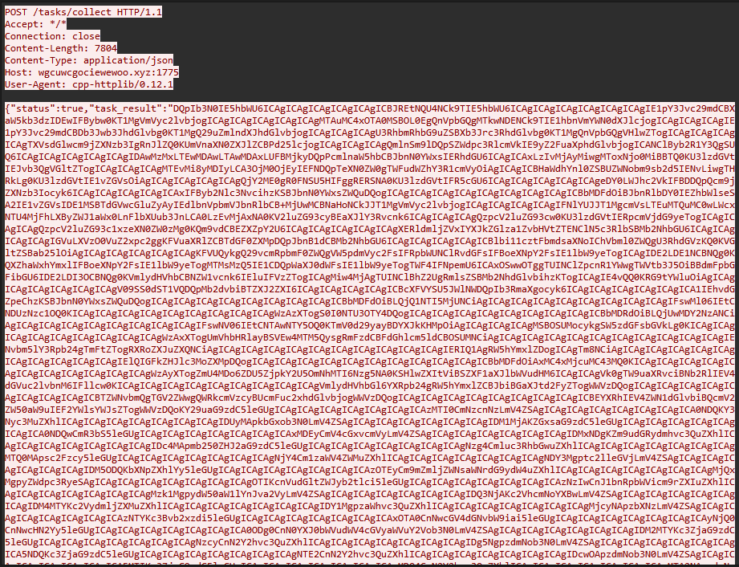

Decoding this Base64 string yields the following data:

```
Host Name:                 IDKMAN
OS Name:                   Microsoft Windows 10 Pro
OS Version:                10.0.19041 N/A Build 19041
OS Manufacturer:           Microsoft Corporation
OS Configuration:          Standalone Workstation
OS Build Type:             Multiprocessor Free
Registered Owner:          BigJoe
Registered Organization:   
Product ID:                00331-10000-00001-AA292
Original Install Date:     1/2/2022, 1:16:42 AM
System Boot Time:          11/2/2022, 7:34:12 AM
System Manufacturer:       Gigabyte Technology Co., Ltd.
System Model:              B660M GAMING X DDR4
System Type:               x64-based PC
Processor(s):              1 Processor(s) Installed.
                           [01]: Intel64 Family 6 Model 151 Stepping 2 GenuineIntel ~2500 Mhz
BIOS Version:              SeaBIOS rel-1.14.0-0-g155821a-prebuilt.qemu.org, 4/1/2014
Windows Directory:         C:\Windows
System Directory:          C:\Windows\system32
Boot Device:               \Device\HarddiskVolume1
System Locale:             en-us;English (United States)
Input Locale:              en-us;English (United States)
Time Zone:                 (UTC) Coordinated Universal Time
Total Physical Memory:     16,154 MB
Available Physical Memory: 13,349 MB
Virtual Memory: Max Size:  19,098 MB
Virtual Memory: Available: 16,278 MB
Virtual Memory: In Use:    2,820 MB
Page File Location(s):     N/A
Domain:                    WORKGROUP
Logon Server:              \\UXINIZSV
Hotfix(s):                 5 Hotfix(s) Installed.
                           [01]: KB4552925
                           [02]: KB4537759
                           [03]: KB4557968
                           [04]: KB5006670
                           [05]: KB5005699
Network Card(s):           1 NIC(s) Installed.
                           [01]: Realtek RTL8139C+ Fast Ethernet NIC
                                 Connection Name: Ethernet
                                 DHCP Enabled:    No
                                 IP address(es)
                                 [01]: 10.127.0.71
                                 [02]: fe80::d59f:dce9:ca12:7894
Hyper-V Requirements:      VM Monitor Mode Extensions: Yes
                           Virtualization Enabled In Firmware: Yes
                           Second Level Address Translation: Yes
                           Data Execution Prevention Available: Yes

conhost.exe                     3124
csrss.exe                      444
csrss.exe                      520
dllhost.exe                     3520
dllhost.exe                     4440
dwm.exe                     1012
explorer.exe                     3148
fontdrvhost.exe                      780
fontdrvhost.exe                      788
install.exe                     1440
lsass.exe                      668
msiexec.exe                     4672
msiexec.exe                     3984
msiexec.exe                     3912
officeclicktorun.exe                     2412
registry                       92
runtimebroker.exe                     3720
runtimebroker.exe                     3952
runtimebroker.exe                     4760
searchapp.exe                     3816
services.exe                      652
sihost.exe                     2724
smss.exe                      356
spoolsv.exe                     1904
sppextcomobj.exe                     2644
sppsvc.exe                     4884
startmenuexperiencehost.exe                     3616
svchost.exe                      772
svchost.exe                      896
svchost.exe                      944
svchost.exe                      516
svchost.exe                      708
svchost.exe                      912
svchost.exe                     1048
svchost.exe                     1064
svchost.exe                     1116
svchost.exe                     1140
svchost.exe                     1248
svchost.exe                     1256
svchost.exe                     1264
svchost.exe                     1412
svchost.exe                     1456
svchost.exe                     1472
svchost.exe                     1532
svchost.exe                     1624
svchost.exe                     1660
svchost.exe                     1676
svchost.exe                     1784
svchost.exe                     1792
svchost.exe                     1912
svchost.exe                     1920
svchost.exe                     1936
svchost.exe                     2012
svchost.exe                     2060
svchost.exe                     2120
svchost.exe                     2212
svchost.exe                     2284
svchost.exe                     2300
svchost.exe                     2404
svchost.exe                     2468
svchost.exe                     2516
svchost.exe                     2532
svchost.exe                     2568
svchost.exe                     2844
svchost.exe                     3104
svchost.exe                     3260
svchost.exe                     3168
svchost.exe                      660
svchost.exe                     4944
svchost.exe                     2172
svchost.exe                     2248
svchost.exe                     3748
svchost.exe                     3712
svchost.exe                     1352
svchost.exe                     4280
svchost.exe                     1832
svchost.exe                     4956
svchost.exe                     2264
sysmon.exe                     2484
system                        4
systeminfo.exe                      908
taskhostw.exe                     2880
trustedinstaller.exe                     2596
unsecapp.exe                     3020
vssvc.exe                     2004
wininit.exe                      528
winlogon.exe                      584
wmiprvse.exe                     5036
wmiprvse.exe                      208
```

This confirms the malware was performing full host reconnaissance and fingerprinting - collecting OS version, hardware, network configuration, and the running process list - and exfiltrating this data back to the C2 server as part of its ongoing task-reporting mechanism.
