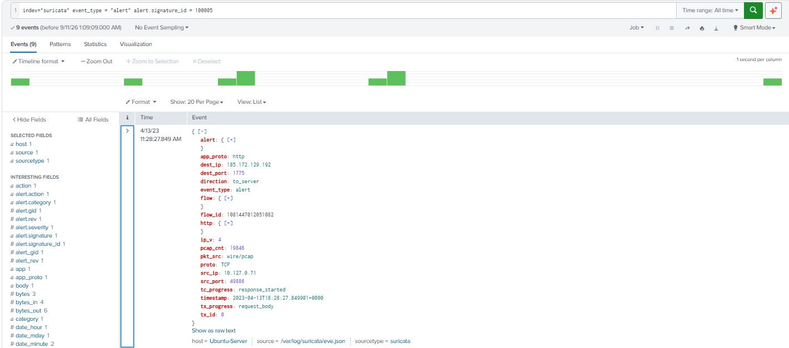
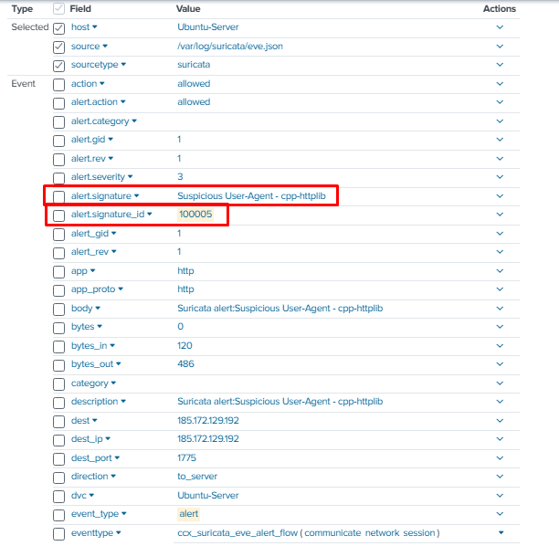
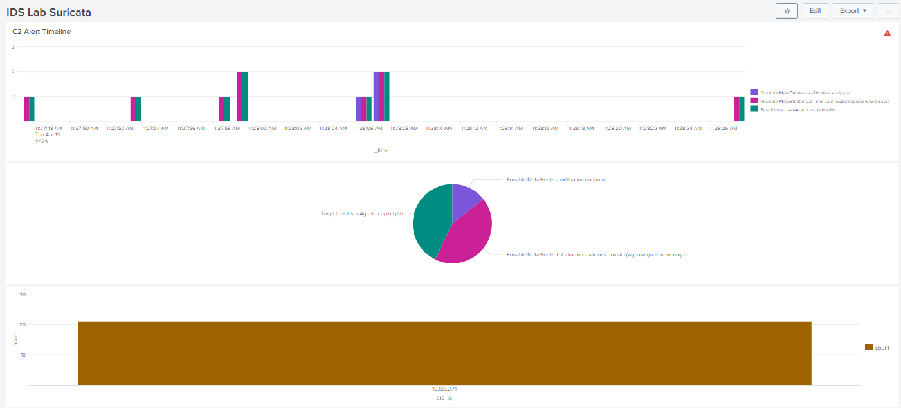
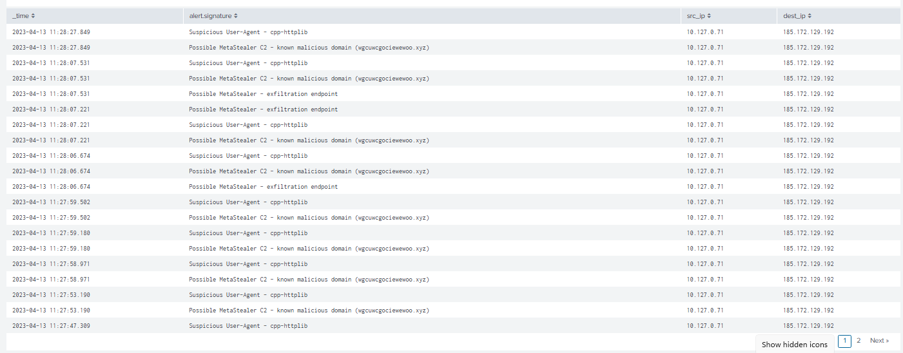

# SIEM Integration Splunk

## Overview

To take the detection work from the IDS lab further, Suricata's
`eve.json` alert logs were ingested into Splunk, turning raw
signature hits from the Malware C2 Traffic Analysis
scenario into a searchable, correlated, and visualized dataset.

## What was done

- Configured a file monitor input in Splunk on
  `/var/log/suricata/eve.json`
- Verified event ingestion and explored the automatically extracted
  fields (`alert.signature`, `alert.signature_id`, `src_ip`,
  `dest_ip`, `alert.severity`, etc.)
- Wrote SPL searches to pull, filter, and aggregate the custom
  Suricata alerts written for the MetaStealer C2 scenario
- Built a 4-panel dashboard to visualize the detection timeline,
  alert distribution, and source of the activity

## Searching for a specific signature



Searches were built around the custom rule SIDs written earlier in
the IDS lab, for example:

```spl
index="suricata" event_type="alert" alert.signature_id=100005
```

Expanding an individual event shows the full parsed structure of the
Suricata alert as ingested by Splunk - protocol, source/destination
IP and port, HTTP metadata, and the exact signature that fired:



## Dashboard - "IDS Lab Suricata"



The dashboard combines four panels, all built from the same
`eve.json` alert data:

**1. C2 Alert Timeline**
```spl
index="suricata" event_type="alert" | timechart span=1s count by alert.signature
```
Shows exactly when each signature fired during the pcap replay,
second by second - making the attack's timeline immediately visible
instead of buried in log lines.

**2. Alert distribution (pie chart)**
```spl
index="suricata" event_type="alert" | stats count by alert.signature
```
Shows the relative volume of each alert type: the malicious domain
signature, the suspicious User-Agent signature, and the exfiltration
endpoint signature.

**3. Alerts by source IP (bar chart)**
```spl
index="suricata" event_type="alert" | stats count by src_ip
```
Confirms all 21 alerts originate from a single source
(`10.127.0.71`) - consistent with the single infected host
identified in the pcap analysis, rather than a distributed attack.

**4. Full alert table**
```spl
index="suricata" event_type="alert" | table _time, alert.signature, src_ip, dest_ip | sort -_time
```


Gives a drill-down view of every individual alert with its exact
timestamp, signature, and source/destination - useful for tracing
the precise sequence of events during the C2 session.
