# 🛡️ Case 02 - UltraVNC Backdoor Campaign | Initial Access via Cloud Drive

**Date of Incident:** Lab-based scenario (inspired by Palo Alto Unit42 research)

**Type:** Malware Dropper / Backdoor / Timestomping / C2 Beacon

**Collection Method:** Sysmon Event Logs → Splunk SIEM

**Investigator:** *Samir Aliguliyev*

**Status:** ✅ Complete

---

## 📋 Table of Contents

1. [Scenario](#scenario)
2. [Investigation Methodology](#investigation-methodology)
3. [Tools Used](#tools-used)
4. [Findings - Q&A](#findings---qa)
5. [Lessons Learned](#lessons-learned)

---

## Scenario

This lab is inspired by real-world research conducted by **Palo Alto Unit42**, who documented an active **UltraVNC backdoor campaign** in which threat actors distributed a trojanized version of the legitimate UltraVNC remote access tool to maintain persistent access to victim systems.

The exercise focuses on the **initial access stage** of the campaign - covering malware delivery via a cloud drive, file dropping, timestomping, network connectivity checks, C2 communication, and process self-termination.

**Investigation scope:** Sysmon-based log analysis via Splunk SIEM. No PCAP or endpoint agent data available - artifact-only.

## Investigation Methodology

| Event ID | Type                   | Purpose |
|----------|------------------------|--------|
| 1        | Process Create         | Malicious process identification |
| 2        | File Creation Time     | Timestomping detection |
| 3        | Network Connect        | C2 / domain check activity |
| 5        | Process Terminate      | Self-termination timestamp |
| 11       | File Create            | Dropped files, paths, timestamps |
| 22       | DNS Query              | Dummy domain connectivity check |

## Tools Used

| Tool | Purpose |
|------|---------|
| **Splunk** | SIEM platform - log ingestion, search & correlation (SPL queries) |
| **Sysmon** | Host-based telemetry (process, network, file events) |

---

## Findings - Q&A

### 1. File Activity

**Q: How many files were created?**
> 🔍 *Artifact: Sysmon Event ID 11 - FileCreate*

```spl
index="sysmonsplunklab" EventCode=11
```

**A:** `56`

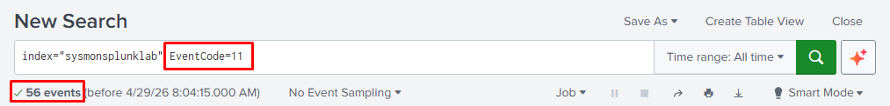

---

### 2. Malicious Process

**Q: What is the malicious process that infected the victim's system?**
> 🔍 *Artifact: Sysmon Event ID 1 - ProcessCreate*

```spl
index="sysmonsplunklab" EventCode=1
```

To identify the malicious process, we queried **Sysmon Event ID 1 (ProcessCreate)** in Splunk, which logs every process execution along with its full command line, file path, parent process, and file hashes.

Reviewing the results, a suspicious executable stood out due to its unusual file path and parent process. We extracted the **SHA256 hash** from the `Hashes` field and submitted it to **VirusTotal** for threat intelligence lookup.

VirusTotal confirmed the file as malicious - flagged by multiple AV engines as a backdoored variant related to the UltraVNC campaign.

**A:** `Preventivo24.02.14.exe.exe`

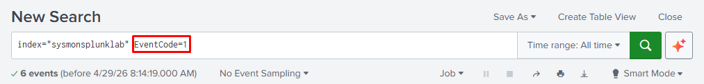
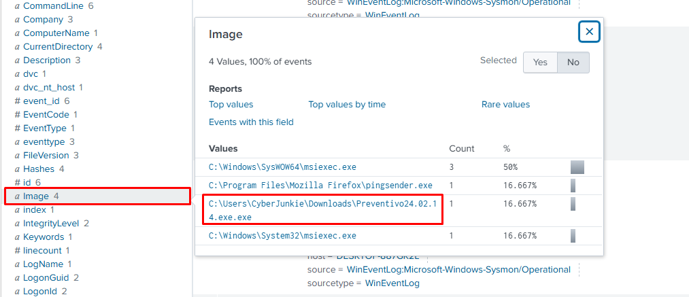
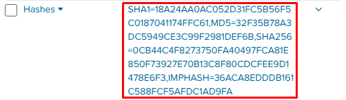
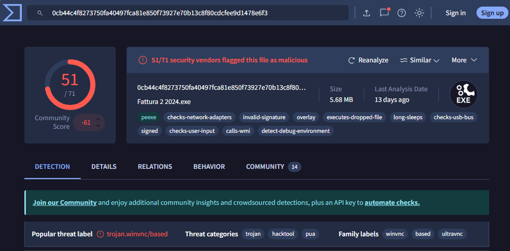

---

### 3. Malware Distribution

**Q: Which cloud drive was used to distribute the malware?**
> 🔍 *Artifact: Sysmon Event ID 11 → Event ID 22 (DNS Query)*

```spl
index="sysmonsplunklab" EventCode=11
```

We started by querying **Sysmon Event ID 11 (FileCreate)** to find all files written to disk. In the results, we identified the suspicious file `Preventivo24.02.14.exe`.

From there, we pivoted by clicking on the timestamp of that event and selecting **±5 seconds** - this revealed all surrounding events at the exact moment the file was written to disk.

Among those events we found a **Sysmon Event ID 22 (DNSQuery)**, which showed a DNS resolution request made at the same time. The queried domain belonged to **Dropbox**, confirming it was used as the malware distribution platform.

**A:** `Dropbox`

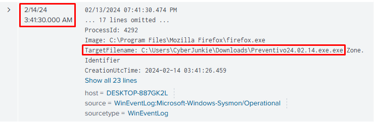
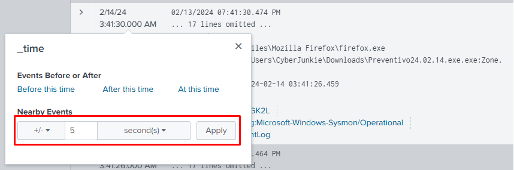
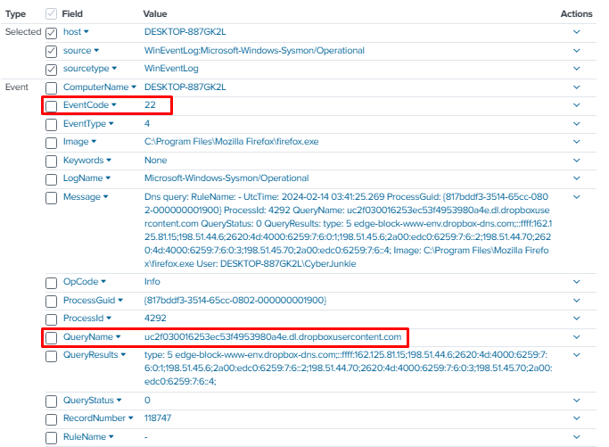

---

### 4. Defense Evasion - Timestomping

**Q: What was the timestamp changed to for a PDF file?**
> 🔍 *Artifact: Sysmon Event ID 2 - FileCreateTime*

```spl
index="sysmonsplunklab" EventCode=2 pdf
```

**A:** `2024-01-14 08:10:06.029`

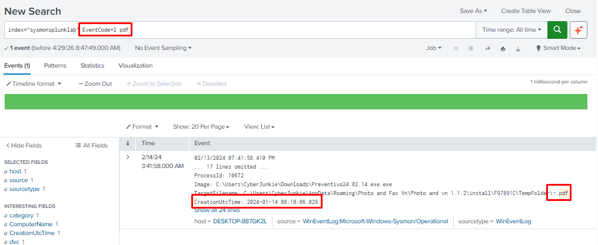

---

### 5. Dropped File Location

**Q: Where was `once.cmd` created on disk? (Full path)**
> 🔍 *Artifact: Sysmon Event ID 11 - FileCreate*

```spl
index="sysmonsplunklab" EventCode=11 once.cmd
```

**A:** `C:\Users\CyberJunkie\AppData\Roaming\Photo and Fax Vn\Photo and vn 1.1.2\install\F97891C\WindowsVolume\Games\once.cmd`

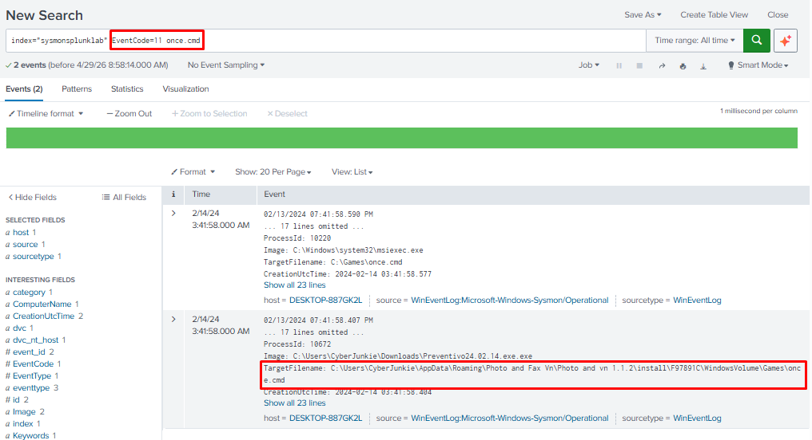

---

### 6. Network Connectivity Check

**Q: What domain did the malicious file attempt to connect to?**
> 🔍 *Artifact: Sysmon Event ID 22 - DNSQuery*

```spl
index="sysmonsplunklab" EventCode=22 Preventivo24.02.14
```

**A:** `www.example.com`

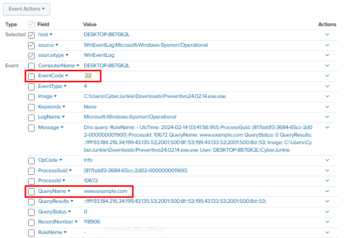

---

### 7. C2 IP Address

**Q: Which IP address did the malicious process attempt to reach?**
> 🔍 *Artifact: Sysmon Event ID 3 - NetworkConnect*

```spl
index="sysmonsplunklab" EventCode=3 Preventivo24.02.14
```

**A:** `93.184.216.34`

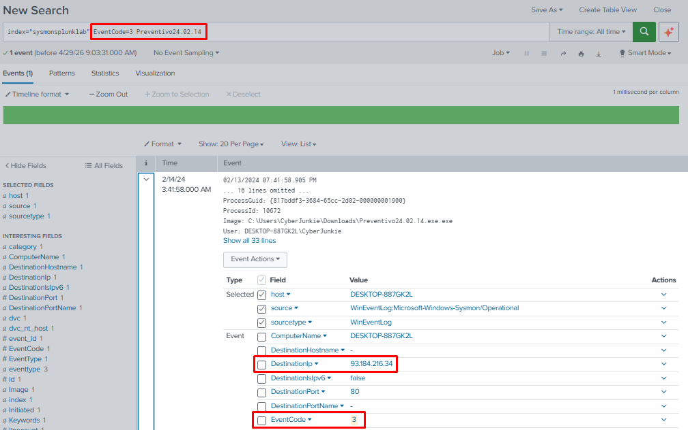

---

### 8. Process Self-Termination

**Q: When did the malicious process terminate itself?**
> 🔍 *Artifact: Sysmon Event ID 5 - ProcessTerminate*

```spl
index="sysmonsplunklab" EventCode=5 Preventivo24.02.14
```

**A:** `2/14/24 3:41:58.000 AM`

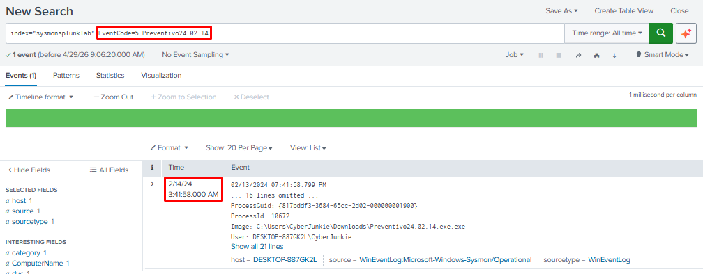

---

## Lessons Learned

### 🔴 Attacker Techniques Observed
- **Cloud storage platforms** abused for malware distribution - bypass many URL reputation filters
- **Timestomping** (`T1070.006`) used to make dropped files appear old, reducing analyst suspicion
- Malware performed a **connectivity check** to a dummy domain before proceeding to C2
- The malicious process **self-terminated** after deploying the backdoor to reduce its footprint
- **Backdoored UltraVNC** provides persistent, legitimate-looking remote access post-infection

### 🔵 Defensive Recommendations
- Alert on **Sysmon Event ID 2** (FileCreateTime changed) - timestomping is a reliable IOC
- Alert on outbound connections from newly dropped executables (correlate Event ID 3 + Event ID 11)
- Restrict or monitor **cloud drive downloads** at proxy/firewall level
- Build Splunk correlation searches to detect **process self-termination shortly after file drops**
- Maintain **Sysmon** deployment across all endpoints - investigation is impossible without it

### 🟡 Forensic Notes
- Splunk SPL allowed rapid filtering and correlation across all Sysmon event types
- Event ID 1 (ProcessCreate) was central to identifying the malicious process and its origin
- Event ID 2 (FileCreateTime) confirmed timestomping - a key defense evasion indicator
- Event ID 3 (NetworkConnect) + Event ID 22 (DNSQuery) revealed both the C2 IP and dummy domain
- Without Sysmon feeding into Splunk, this investigation would have had zero visibility
