# Website Defacement | Po1s0n1vy Group vs imreallynotbatman.com

**Date of Incident:** Lab-based scenario (Splunk BOTS v1 dataset)

**Type:** Web Application Attack / Vulnerability Scanning / Website Defacement

**Collection Method:** Web/Stream logs → Splunk SIEM

**Investigator:** *Samir Aliguliyev*

**Status:** ✅ Complete

---

## 📋 Table of Contents

1. [Scenario](#scenario)
2. [Investigation Methodology](#investigation-methodology)
3. [Tools Used](#tools-used)
4. [Findings - Q&A](#findings---qa)
5. [Lessons Learned](#lessons-learned)

---

## Scenario

Today is Alice's first day at the Wayne Enterprises' Security Operations Center. Lucius sits Alice down and gives her first assignment: a memo from the **Gotham City Police Department (GCPD)**.

GCPD found evidence online ([pastebin.com/Gw6dWjS9](http://pastebin.com/Gw6dWjS9)) that the website **www.imreallynotbatman.com** - hosted on Wayne Enterprises' IP address space - has been compromised. The threat actor group behind this, known as **Po1s0n1vy**, has multiple objectives, but a key part of their modus operandi is to **deface websites** in order to embarrass their victims.

Lucius has asked Alice to determine if www.imreallynotbatman.com (the personal blog of Wayne Enterprises' CEO) was really compromised.

**Investigation scope:** Web traffic logs (`stream:http`) analyzed via Splunk SIEM.

## Investigation Methodology

| Data Source | Type | Purpose |
|---|---|---|
| `stream:http` | Web traffic | Identify scanning activity, user-agents, HTTP requests to the site |

## Tools Used

| Tool | Purpose |
|------|---------|
| **Splunk** | SIEM platform - log ingestion, search & correlation (SPL queries) |
| **Splunk Stream** | Network traffic capture parsed into HTTP/DNS events |

---

## Findings - Q&A

### 1. Reconnaissance / Vulnerability Scanning

**Q: What is the likely IPv4 address of someone from the Po1s0n1vy group scanning imreallynotbatman.com for web application vulnerabilities?**
> 🔍 *Artifact: stream:http - http_user_agent field*

```spl
index=botsv1 sourcetype=stream:http site="imreallynotbatman.com"
| stats count by http_user_agent
| sort + count
```

Sorting the results by ascending count surfaced a large number of rare, non-browser `http_user_agent` values - many of them containing malformed strings typical of automated vulnerability scanning (SQL injection payloads, command injection attempts, blind time-based SQLi tests).

The common marker across nearly all of these entries was the string **`acunetix_wvs_security_test`**, which is a known signature of the **Acunetix Web Vulnerability Scanner (WVS)** injecting test payloads directly into the User-Agent header while probing for injection vulnerabilities.

To pinpoint the source, we filtered on this signature and pivoted to the source IP:

```spl
index=botsv1 sourcetype=stream:http site="imreallynotbatman.com" http_user_agent="*acunetix_wvs_security_test*"
| stats count by src
```

**A:** `40.80.148.42`

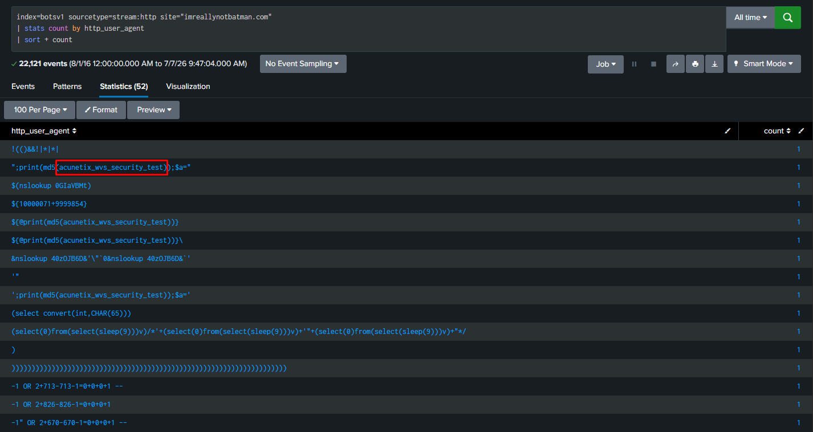
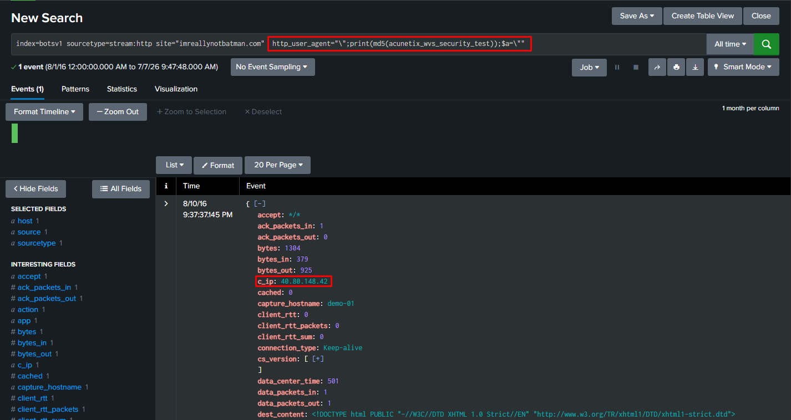

---

### 2. Scanner Attribution

**Q: What company created the web vulnerability scanner used by Po1s0n1vy? Type the company name.**
> 🔍 *Artifact: derived from http_user_agent finding (Q1)*

No additional SPL query was required for this question - the answer follows directly from the User-Agent signature identified previously. The recurring string `acunetix_wvs_security_test` is a built-in self-identification marker embedded by the **Acunetix Web Vulnerability Scanner (WVS)** into request headers during automated scanning, which is a commercial product developed by the company Acunetix.

**A:** `Acunetix`

---

### 3. Technology Fingerprinting

**Q: What content management system is imreallynotbatman.com likely using?**
> 🔍 *Artifact: stream:http - uri field*

```spl
index=botsv1 sourcetype=stream:http site="imreallynotbatman.com"
| stats count by uri
| sort - count
```

Reviewing the most frequently requested URIs revealed a large volume of requests prefixed with `/joomla/` - including `/joomla/administrator/index.php` (the Joomla admin login panel), `/joomla/templates/protostar/` (Joomla's default template), and `/joomla/media/jui/` (Joomla UI JavaScript library). These paths are all characteristic of a **Joomla** installation.

**A:** `Joomla`

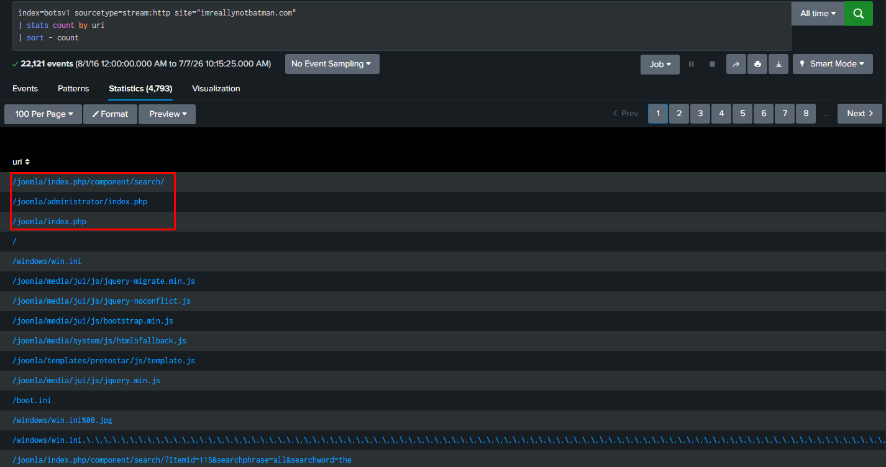

---

### 4. Defacement Artifact

**Q: What is the name of the file that defaced the imreallynotbatman.com website? Please submit only the name of the file with extension.**
> 🔍 *Artifact: stream:http - uri field (reversed traffic direction)*

The key nuance in this question is that the traffic direction flips: since the web server has already been compromised, it is now **imreallynotbatman.com's own server** (`192.168.250.70`) acting as the client, reaching out to the attacker's staging server to pull down the defacement file - rather than the attacker connecting inbound.

```spl
index=botsv1 sourcetype=stream:http src_ip=192.168.250.70
| stats count by uri
```

Reviewing the `uri` values for this source IP revealed an outbound GET request to an external domain for a file named `poisonivy-is-coming-for-you-batman.jpeg` - clearly branded after the Po1s0n1vy group and confirming the website had, in fact, been defaced.

**A:** `poisonivy-is-coming-for-you-batman.jpeg`

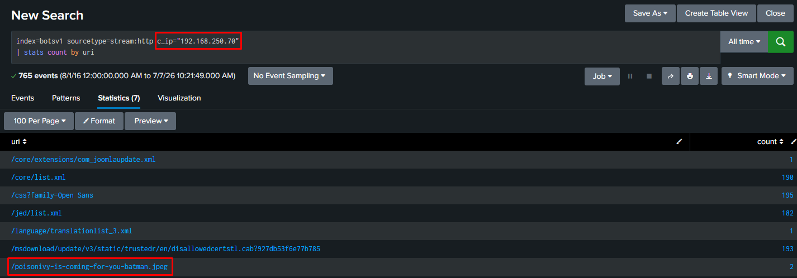

---

### 5. Dynamic DNS Infrastructure

**Q: This attack used dynamic DNS to resolve to the malicious IP. What fully qualified domain name (FQDN) is associated with this attack?**
> 🔍 *Artifact: stream:http - dest / uri fields (same event as Q4)*

```spl
index=botsv1 sourcetype=stream:http c_ip="192.168.250.70" uri="/poisonivy-is-coming-for-you-batman.jpeg"
```

The same outbound request that revealed the defacement file (`poisonivy-is-coming-for-you-batman.jpeg`) also contained the destination hostname it was retrieved from. The domain `jumpingcrab.com` is a known **dynamic DNS (DDNS)** provider, which allows an attacker to keep the same domain name while freely changing the IP address it resolves to - a common technique for maintaining resilient staging/C2 infrastructure.

**A:** `prankglassinebracket.jumpingcrab.com`

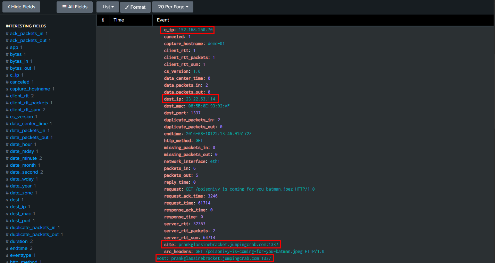

---

### 6. Threat Actor Infrastructure

**Q: What IPv4 address has Po1s0n1vy tied to domains that are pre-staged to attack Wayne Enterprises?**
> 🔍 *Artifact: stream:http - dest_ip field*

```spl
index=botsv1 sourcetype=stream:http c_ip="192.168.250.70" uri="/poisonivy-is-coming-for-you-batman.jpeg"
```

Filtering on the exact request that pulled the defacement file, the `dest_ip` field directly revealed the IP address the FQDN `prankglassinebracket.jumpingcrab.com` was resolving to at the time of the attack. This is the same server that hosted the defacement image, confirming it was **pre-staged** as part of Po1s0n1vy's attack infrastructure ahead of the operation against Wayne Enterprises.

**A:** `23.22.63.114`


---

### 7. Brute Force Attack

**Q: What IPv4 address is likely attempting a brute force password attack against imreallynotbatman.com?**
> 🔍 *Artifact: stream:http - raw events containing password field*

```spl
index="botsv1" sourcetype="stream:http"
| regex (passw)
```

Filtering all HTTP events containing the string `passw` (matching login/authentication attempts) and breaking them down by `src_ip` showed a heavily skewed distribution: `23.22.63.114` accounted for 93.6% of all password-related requests (1,235 events), versus only 6.4% (84 events) from `40.80.148.42`. This overwhelming concentration of authentication attempts from a single source is a clear indicator of an automated brute force attack.

**A:** `23.22.63.114`

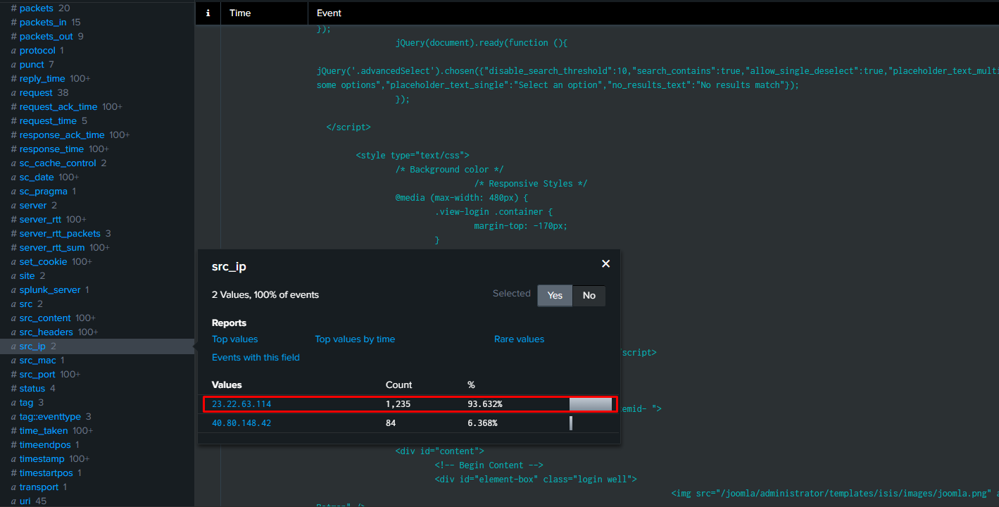

---

### 8. Malware Upload

**Q: What is the name of the executable uploaded by Po1s0n1vy? Please include the file extension.**
> 🔍 *Artifact: stream:http - multipart/form-data POST requests*

```spl
index=botsv1 sourcetype=stream:http dest_ip="192.168.250.70" http_method=POST multipart/form-data *.exe
```

File uploads through web forms are transmitted as `POST` requests with a `multipart/form-data` content type. Filtering HTTP traffic to the web server on these criteria, combined with a search for `.exe` file references, surfaced two candidate executables. Of the two, one was clearly the malicious payload uploaded through the compromised Joomla admin panel following the successful brute force login.

**A:** `3791.exe`

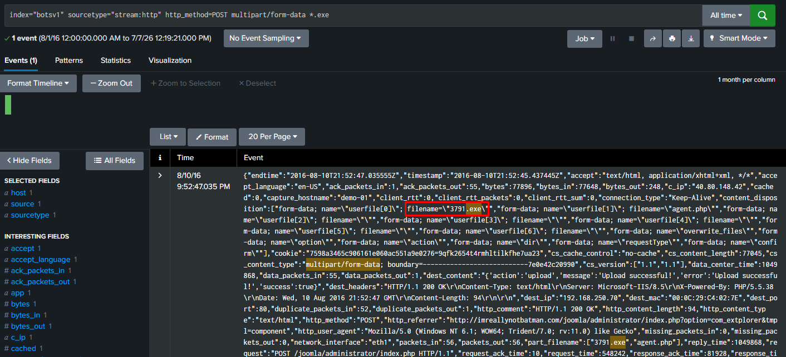

---

### 9. Malware Hash Identification

**Q: What is the MD5 hash of the executable uploaded?**
> 🔍 *Artifact: Sysmon Event ID 1 - ProcessCreate (Hashes field)*

```spl
index="botsv1" EventCode=1 3791.exe
```

HTTP logs don't carry file hashes, so we pivoted to **Sysmon Event ID 1 (ProcessCreate)** on the web server, which logs the full command line and multiple hash algorithms (MD5, SHA1, SHA256, IMPHASH) whenever a process is executed. The search returned several events referencing `3791.exe` with different hash values, since the filename appears in multiple contexts (file references, scans, etc.) - not all of them representing actual code execution.

The correct event was identified by filtering for `ParentCommandLine` equal to `cmd.exe /c "3791.exe 2>&1"`, which confirms the file was executed via the command line rather than simply referenced elsewhere. The `Hashes` field on that specific event provided the correct MD5 value.

**A:** `AAE3F5A29935E6ABCC2C2754D12A9AF0`

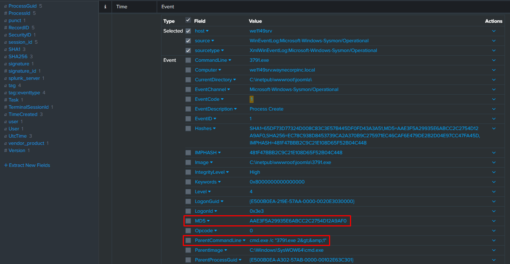

---

### 10. Spear Phishing Malware (OSINT)

**Q: GCPD reported that common TTPs for the Po1s0n1vy APT group, if initial compromise fails, is to send a spear phishing email with custom malware attached to their intended target. This malware is usually connected to Po1s0n1vy's initial attack infrastructure. Using research techniques, provide the SHA256 hash of this malware.**
> 🔍 *Artifact: External OSINT lookup (VirusTotal - IP Relations) on the known malicious IP*

This question falls outside of Splunk's log data entirely and required external threat intelligence research. Using the malicious IP identified earlier (`23.22.63.114`), we queried **VirusTotal's Relations** tab to see which files have been submitted that communicate with or reference this IP.

Among the related files, one stood out: `MirandaTateScreensaver.scr.exe` - a name referencing a character from the Batman universe, consistent with Po1s0n1vy's thematic targeting of Wayne Enterprises, and packaged as a fake screensaver (a common spear phishing lure format).

**A:** `9709473ab351387aab9e816eff3910b9f28a7a70202e250ed46dba8f820f34a8`

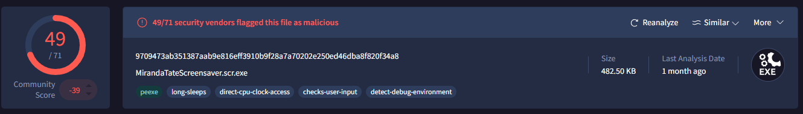

---

### 11. Brute Force Attack - Timeline Start

**Q: What was the first brute force password used?**
> 🔍 *Artifact: stream:http - form_data field, sorted chronologically*

```spl
index="botsv1" sourcetype="stream:http" http_method=POST src_ip=23.22.63.114
| sort -_time desc
```

Reusing the brute force event set identified earlier, we extracted the `Password` value from `form_data` for every login attempt and sorted the results in ascending order by `_time`. The very first entry in the sorted table represents the earliest password attempted in the attack.

**A:** `12345678`

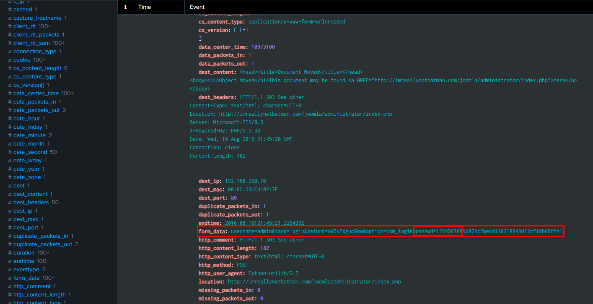

---

### 12. Brute Force Password - OSINT Correlation

**Q: One of the passwords in the brute force attack is James Brodsky's favorite Coldplay song. We are looking for a six character word on this one. Which is it?**
> 🔍 *Artifact: stream:http - form_data field, correlated with external OSINT (Coldplay discography)*

```spl
index="botsv1" sourcetype="stream:http" http_method=POST src_ip=23.22.63.114
| rex field=form_data "passwd=(?<password>\w{6})\b"
| search password IN ("Yellow", "Clocks", "Sparks", "Shiver", "Oceans")
| where isnotnull(password)
| table password
```

This question combined log analysis with external research. We extracted every 6-character password attempted during the brute force attack using a regex against the `form_data` field, then cross-referenced that list against known short (6-letter) Coldplay song titles researched externally (Yellow, Clocks, Sparks, Shiver, Oceans, etc.). One of them matched a password actually used in the attack.

**A:** `Yellow`

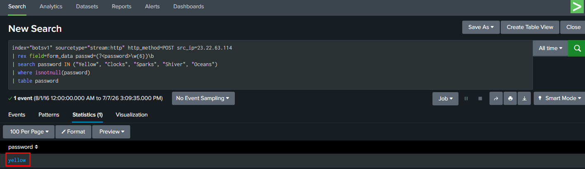

---

### 13. Correct Admin Password

**Q: What was the correct password for admin access to the content management system running "imreallynotbatman.com"?**
> 🔍 *Artifact: stream:http - form_data field, correlated by repeated password + HTTP status*

```spl
index="botsv1" sourcetype="stream:http" http_method=POST
| rex field=form_data "passwd=(?<password>[^&]+)"
| where isnotnull(password)
| table form_data password
| stats count by password
| sort - count
```

Logic: during a brute force attack, once the attacker finds the correct password, they typically try it again to confirm access (e.g., to log in for real afterward). Grouping all attempted passwords and counting occurrences revealed one value that appeared twice for the admin account, unlike the rest of the (mostly random) single-use guesses - a strong indicator of the successful, reused password.

**A:** `batman`

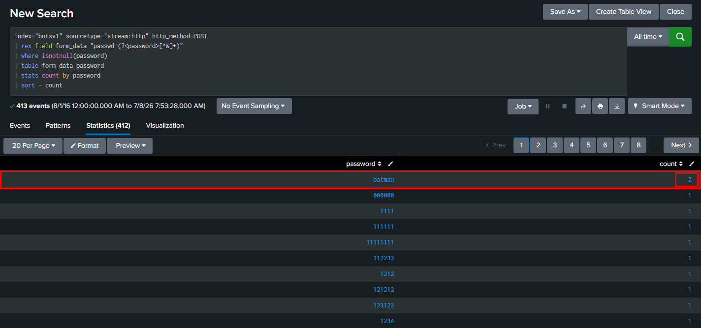

---

### 14. Brute Force Password Statistics

**Q: What was the average password length used in the password brute forcing attempt? (Round to the closest whole integer)**
> 🔍 *Artifact: stream:http - form_data field, statistical analysis*

```spl
index="botsv1" sourcetype="stream:http" http_method=POST
| rex field=form_data "passwd=(?<password>[^&]+)"
| where isnotnull(password)
| eval passw_len=len(password)
| stats avg(passw_len) as avg_len
```

Reusing the same brute force event set, we extracted every attempted password from `form_data`, calculated the character length of each with `eval len()`, and computed the average across all attempts, rounded to the nearest whole number.

**A:** `6`

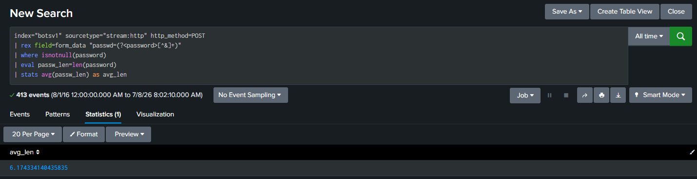

---

### 15. Time-to-Compromise

**Q: How many seconds elapsed between the time the brute force password scan identified the correct password and the compromised login? (Round to 2 decimal places)**
> 🔍 *Artifact: stream:http - form_data field, manual timestamp comparison*

```spl
index="botsv1" sourcetype="stream:http" http_method=POST "passwd=batman"
| table _time form_data
```

Since `batman` was confirmed as the correct password, we filtered for every event where it appears in `form_data` and displayed the raw timestamps in a table. This returned exactly two events - the first representing the moment the brute force scan tried `batman` among its many guesses, and the second representing the attacker's actual successful login using that same password. Subtracting the two `_time` values gives the elapsed time between discovery and compromise.

**A:** `92.17`

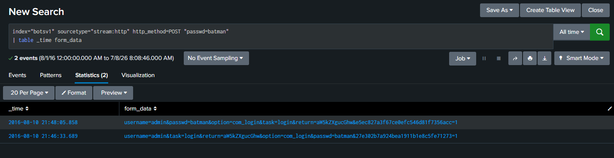

---

### 16. Unique Password Count

**Q: How many unique passwords were attempted in the brute force attempt?**
> 🔍 *Artifact: stream:http - form_data field, distinct count*

```spl
index="botsv1" sourcetype="stream:http" http_method=POST
| rex field=form_data "passwd=(?<password>[^&]+)"
| where isnotnull(password)
| stats dc(password) as unique_passwd
```

Reusing the same brute force event set, we extracted every attempted password and applied `dc()` (distinct count) instead of a plain `count`, so that a password reused more than once (such as `batman`) is only counted a single time.

**A:** `412`

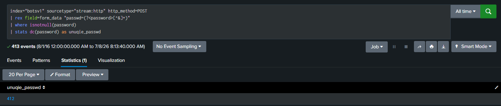

---

## Lessons Learned

### 🔴 Attacker Techniques Observed
- Automated vulnerability scanner (**Acunetix WVS**) used for reconnaissance against the public-facing Joomla web server
- Brute force attack against the CMS admin panel, ultimately succeeding with the weak password `batman`
- **Dynamic DNS (DDNS)** infrastructure (`jumpingcrab.com`) used to keep a stable domain while rotating the underlying malicious IP
- Malicious executable (`3791.exe`) uploaded through the compromised admin panel and executed on the server
- Website **defacement** used to publicly embarrass the victim, consistent with Po1s0n1vy's known modus operandi
- Spear phishing fallback technique (fake screensaver executable) identified via OSINT as part of the group's broader TTPs

### 🔵 Defensive Recommendations
- Alert on `http_user_agent` values containing known scanner signatures (`acunetix`, `sqlmap`, `nikto`, `nmap`, etc.)
- Enforce strong password policies and account lockout/rate-limiting on CMS admin login pages to prevent brute forcing
- Monitor and restrict file uploads through CMS admin panels, especially executable file types
- Flag outbound connections from web servers to newly registered or dynamic DNS domains
- Deploy Sysmon on public-facing servers to capture process execution and file hash telemetry

### 🟡 Forensic Notes
- `stream:http` provided sufficient visibility into request-level metadata (User-Agent, source IP, form data, URIs) to reconstruct the majority of the attack timeline
- Sysmon Event ID 1 (ProcessCreate) was essential for confirming actual malware execution and retrieving file hashes
- External OSINT sources (VirusTotal) were necessary to fully attribute the spear phishing payload, since this data does not exist in the local Splunk environment
- Reused values (repeated passwords, shared IPs/domains) were consistently the strongest indicators for pinpointing successful attack steps within a larger noise of automated attempts
